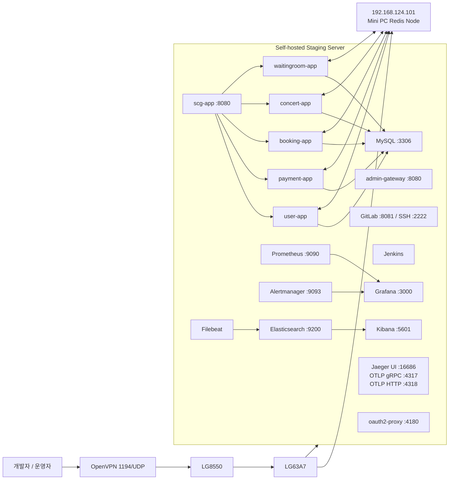
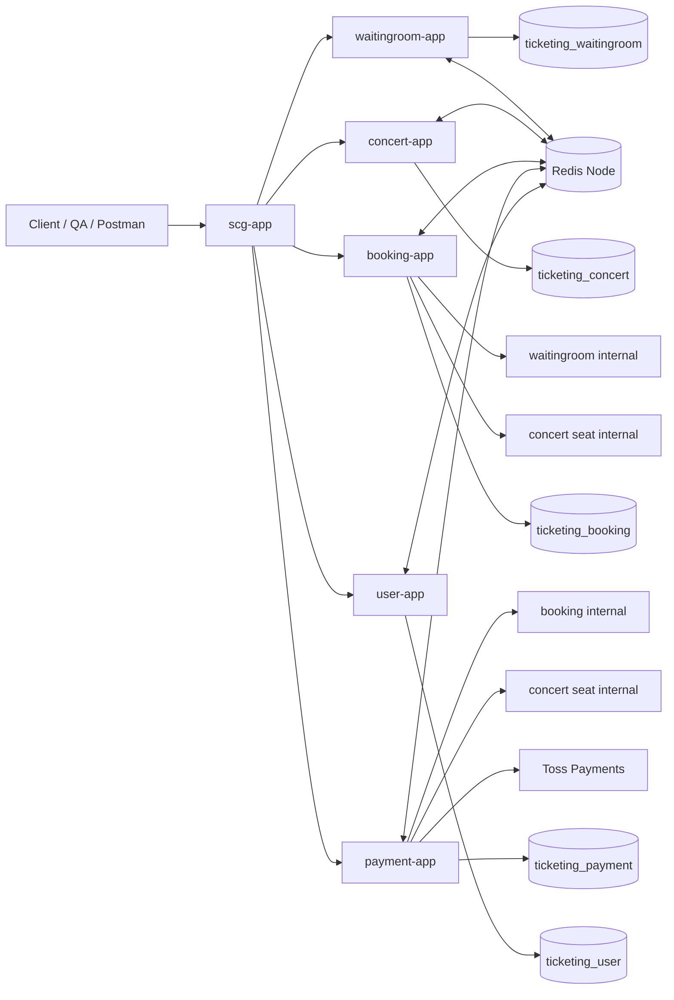
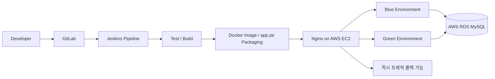

# 02. 아키텍처 및 인프라 설계 (Infrastructure & Delivery)

## 1. 설계 요약

이 프로젝트는 **집 self-hosted staging**과 **AWS 배포 환경**을 분리해서 운영합니다.

- 집 staging: WSL2 + Docker Compose 기반 통합 검증 환경
- 별도 Redis 노드: 미니 PC(192.168.124.101)에 캐시/대기열/멱등성 제어 집중
- 운영/Admin plane: oauth2-proxy + admin-gateway + GitLab/Jenkins/Grafana/Prometheus
- 서비스/API plane: `scg-app` + `waitingroom-app` + `concert-app` + `booking-app` + `payment-app` + `user-app`
- 배포 plane: GitLab -> Jenkins -> AWS EC2 Nginx Blue/Green -> AWS RDS(MySQL)

핵심 설계 의도는 아래 세 가지입니다.

1. **장애 전파 범위 축소**: staging 서버와 Redis 노드를 분리
2. **외부 노출면 최소화**: OpenVPN 1194/UDP만 개방
3. **운영 접근 중앙통제**: OAuth2/OIDC + GitLab 2FA + Bitwarden/OTP 관리

---

## 2. 네트워크 및 staging 토폴로지



### 네트워크 분리 포인트

- LG63A7의 DHCP 대상은 사실상 `192.168.124.100`(staging)과 `192.168.124.101`(Redis node)로 제한
- 공유기 2중 NAT 구조에서도 외부 개방 포트는 **1194/UDP 하나만 유지**
- 내부 서비스, 모니터링, CI/CD, GitLab 관리 화면은 **VPN 접속 이후에만 접근**

---

## 3. 운영(Admin) Plane vs 서비스(API) Plane

### 3.1 운영(Admin) Plane

운영/Admin plane에는 다음이 포함됩니다.

- `oauth2-proxy`
- `admin-gateway`
- `GitLab`
- `Jenkins`
- `Prometheus`
- `Grafana`

역할:

- GitLab OIDC/OAuth2를 통한 내부 도구 접근 통합
- MFA(2FA) 기반 운영 접근 통제
- 관리자 화면을 일반 서비스 API plane과 분리

### 3.2 서비스(API) Plane

서비스/API plane에는 다음이 포함됩니다.

- `scg-app` (Spring Cloud Gateway)
- `waitingroom-app`
- `concert-app`
- `booking-app`
- `payment-app`
- `user-app`

역할:

- 사용자/테스트 트래픽을 `scg-app`에서 받아 각 도메인 서비스로 전달
- `/internal/**`는 게이트웨이에서 차단하여 내부 서비스 API를 외부에 숨김
- `X-Correlation-Id`, `X-Auth-User-Id` 등 공통 헤더 표준화

---

## 4. 서비스 간 호출 구조



### 대표 흐름

#### 예약 생성

1. 사용자 -> `waitingroom-app`에서 대기열 진입
2. 순번 통과 시 ACTIVE token 발급
3. 사용자 -> `booking-app` 예약 생성 요청
4. `booking-app` -> `waitingroom-app internal` token 검증
5. `booking-app` -> `concert-app internal` seat HOLD
6. `booking-app` DB에 reservation 저장
7. `booking-app` -> `waitingroom-app internal` token consume

#### 결제 승인

1. 사용자 -> `payment-app` prepare
2. `payment-app` -> `booking-app internal` reservation 조회
3. `payment-app` -> `concert-app internal` seat/price 조회
4. `payment-app` DB에 READY payment 저장
5. 사용자 -> Toss 인증 후 `payment-app` confirm
6. `payment-app` -> Toss 승인 API
7. `payment-app` DB에 DONE 반영
8. `payment-app` -> `booking-app internal` reservation confirm
9. `booking-app` -> `concert-app internal` seat SOLD
10. booking 확정 실패 시 `payment-app`이 자동 환불 보상 시도

---

## 5. CI/CD 파이프라인



### 배포 단계

1. GitLab push / merge
2. Jenkins가 build + test + package 수행
3. EC2의 Nginx가 Blue 또는 Green 중 비활성 슬롯에 새 버전 배포
4. health check 통과 시 트래픽 스위치
5. 문제 발생 시 이전 슬롯으로 즉시 롤백

### 왜 Blue/Green을 선택했는가

- 배포 중에도 사용자 영향 없이 트래픽 전환 가능
- Jenkins에서 이전 버전을 유지한 상태로 검증 가능
- 장애 발생 시 DNS 전파 없이 Nginx upstream만 되돌리면 됨

---

## 6. 현재 IaC 범위와 정직한 서술 방식

문서 제목에는 `Infrastructure as Code`를 쓰되, **현재 범위를 정확하게 구분해서 쓰는 것이 좋습니다.**

### 현재 이미 코드/설정으로 관리되는 영역

- `docker-compose.yml` 기반 staging 구성
- `application.yml` / `application.properties`
- `GatewayRouteConfig`
- Jenkins pipeline 스크립트
- Nginx blue/green 설정
- Docker image / build.gradle / settings.gradle

### 아직 IaC 완성형이라고 부르기 어려운 영역

- AWS EC2 / RDS / Security Group / IAM / VPC를 Terraform으로 전부 관리하는 단계는 아님
- 운영 OS bootstrap(패키지, users, systemd, hardening)을 Ansible/SSM으로 표준화한 단계는 아님

### 포트폴리오 문장 예시

> Docker Compose와 애플리케이션 설정 파일, Gateway/배포 설정을 코드로 관리하며 self-hosted staging을 선언적으로 운영했고, AWS 리소스는 차기 단계에서 Terraform/Ansible로 확장할 수 있도록 구조를 분리했습니다.

이렇게 쓰면 과장 없이 강점이 잘 살아납니다.

---

## 7. 권장 IaC 확장 로드맵

### 7.1 Terraform 권장 범위

- VPC / Subnet / Route Table
- Security Group
- EC2
- ALB / Nginx 앞단
- RDS
- CloudWatch / IAM Role
- SSM Parameter Store or Secrets Manager

### 7.2 Ansible 또는 SSM Document 권장 범위

- EC2 bootstrap
- Nginx 설치 및 설정 반영
- Docker / Java / CloudWatch Agent 설치
- OS hardening
- logrotate / backup script 반영

### 7.3 추천 디렉터리 구조

```text
infra/
  compose/
    docker-compose.staging.yml
  nginx/
    blue-green/
  jenkins/
    Jenkinsfile
  terraform/
    envs/
      staging/
      prod/
    modules/
      network/
      ec2/
      rds/
  ansible/
    inventories/
    roles/
```

---

## 8. 이 아키텍처의 장점

- **경계가 명확함**: admin plane, API plane, DB/Redis plane이 논리적으로 분리됨
- **관측성이 내장됨**: Prometheus/Grafana + ELK + Jaeger
- **결제 정합성에 유리함**: payment와 booking을 분리하면서도 internal API + 보상 로직으로 정합성 확보
- **확장성이 좋음**: SCG, starter 분리, Spring Cloud Config 도입 기반이 이미 준비됨

---

## 9. 포트폴리오에서 꼭 강조할 문장

- 단순 CRUD 서비스가 아니라 **플랫폼/운영 관점에서 서비스 경계, 관측성, 보안, 배포 자동화를 함께 설계했다**
- self-hosted staging과 AWS 배포 경로를 분리해 **실험/검증 환경과 운영 경로를 구분했다**
- 외부 노출면을 VPN-only로 최소화하고, 내부 운영 도구는 OIDC/OAuth2와 MFA로 보호했다
- Redis를 별도 노드로 분리해 **대기열, 캐시, 멱등성, 분산 제어 역할을 전담**시켰다