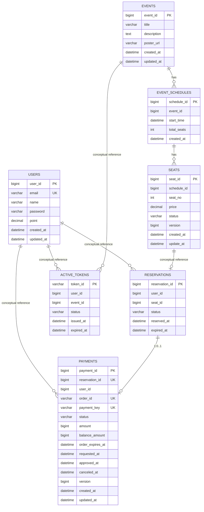

# 03. 데이터베이스 설계 및 최적화

## 1. 설계 원칙

이 프로젝트의 DB 설계는 **서비스별 schema 분리 + ID 참조 기반**을 기본 원칙으로 둡니다.

- `ticketing_user`
- `ticketing_concert`
- `ticketing_booking`
- `ticketing_payment`
- `ticketing_waitingroom`

즉, 마이크로서비스 경계 때문에 **서비스 간 FK를 강하게 물지 않고**, 각 서비스가 자기 DB/스키마의 source of truth를 갖습니다.  
서비스 간 관계는 **물리 FK**가 아니라 **개념적 참조(conceptual reference)**로 관리합니다.

---

## 2. 개념 ERD



### 해석 포인트

- `reservations -> payments`는 비즈니스적으로 거의 1:1입니다. 이를 `payments.reservation_id` unique로 강제합니다.
- `seats`는 `schedule_id + seat_no` unique로 같은 회차 내 중복 좌석을 막습니다.
- `payments.order_id`, `payments.payment_key`는 외부 PG 정합성을 위해 unique입니다.
- `active_tokens`는 `token_id`를 UUID 문자열로 두어 예측 가능성을 낮춥니다.

---

## 3. 테이블 요약

| Service | Schema | Table | 역할 |
| --- | --- | --- | --- |
| user-app | ticketing_user | users | 사용자 기본 정보 및 포인트 |
| concert-app | ticketing_concert | events | 공연 카탈로그 |
| concert-app | ticketing_concert | event_schedules | 공연 회차 |
| concert-app | ticketing_concert | seats | 좌석 재고 / HOLD / SOLD |
| booking-app | ticketing_booking | reservations | 임시 예약 및 확정 상태 |
| payment-app | ticketing_payment | payments | 결제/환불 상태 |
| waitingroom-app | ticketing_waitingroom | active_tokens | 입장 가능 토큰 |

---

## 4. 현재 인덱스 설계

| Table | 현재 인덱스 / 제약 | 목적 |
| --- | --- | --- |
| `users` | `UK(email)` | 중복 가입 차단, 로그인/식별 조회 |
| `event_schedules` | `IDX(event_id, start_time)` | 특정 공연의 회차 목록 조회 최적화 |
| `seats` | `UK(schedule_id, seat_no)` | 회차 내 좌석 중복 방지 |
| `seats` | `@Version` | 낙관적 락으로 동시 좌석 선점 제어 |
| `reservations` | `IDX(user_id)` | 내 예약 목록 조회 |
| `reservations` | `IDX(status, expired_at)` | 만료 예약 배치 및 상태 기반 조회 |
| `payments` | `UK(order_id)` | PG 주문번호 정합성 |
| `payments` | `UK(reservation_id)` | 예약 1건당 결제 1건 |
| `payments` | `UK(payment_key)` | PG 승인 결과 중복 반영 방지 |
| `payments` | `IDX(user_id)` | 내 결제 조회 |
| `payments` | `IDX(status)` | 상태별 모니터링/운영 조회 |
| `payments` | `IDX(reservation_id, user_id)` | 예약-결제 ownership 조회 |
| `active_tokens` | `IDX(token_id)` | 토큰 상세 조회 |
| `active_tokens` | `IDX(user_id, event_id)` | 중복 발급 방지 / 기존 토큰 조회 |

---

## 5. 추가로 권장하는 인덱스

### 5.1 `seats(schedule_id, status, seat_no)`

현재 `AVAILABLE 좌석 조회`는 `scheduleId + status` 조건이 핵심입니다.  
좌석 수가 많아지면 아래 인덱스를 추가하는 것이 좋습니다.

```sql
CREATE INDEX idx_seat_schedule_status_no
ON ticketing_concert.seats (schedule_id, status, seat_no);
```

### 5.2 `reservations(user_id, status, reserved_at desc)`

내 예약 목록을 상태와 최근순으로 자주 본다면 아래 인덱스가 유리합니다.

```sql
CREATE INDEX idx_reservation_user_status_reserved
ON ticketing_booking.reservations (user_id, status, reserved_at);
```

### 5.3 `payments(user_id, created_at desc)` 또는 `(user_id, status, approved_at)`

사용자별 결제 이력 조회가 늘어나면 ordering까지 고려한 인덱스를 추가할 수 있습니다.

---

## 6. 파티셔닝 전략: 현재와 미래를 분리해서 적기

### 현재 상태

현재 코드에는 **실제 MySQL 파티셔닝이 구현되어 있지 않습니다.**  
포트폴리오 문서에는 이 점을 명확히 적는 것이 좋습니다.

### 미래 확장 전략

#### 월 단위 range partition 후보

- `ticketing_payment.payments`
- `ticketing_booking.reservations`

이유:

- 시간 기반 생성이 명확함
- 운영 조회, 정산, 이력성 보관이 자연스러움
- 특정 월 데이터 purge/archive가 쉬움

#### 파티셔닝 문장 예시

> 현재는 단일 테이블 + 인덱스 최적화로 운영하고 있으며, 트래픽이 증가하는 단계에서는 `payments.created_at`, `reservations.reserved_at` 기준 월 단위 range partition을 도입할 수 있도록 설계를 열어 두었습니다.

### 파티셔닝을 지금 당장 안 하는 이유

- 데이터 규모가 아직 작을 때는 파티션 관리 비용이 더 큼
- 잘못된 파티셔닝은 오히려 쿼리/운영 복잡도를 높일 수 있음
- 우선은 인덱스 설계와 slow query 분석이 더 큰 효과를 줌

---

## 7. 캐싱 전략

## 7.1 Redis의 역할 분리

이 프로젝트에서 Redis는 단순한 조회 캐시가 아닙니다.

### Redis 사용처

1. **대기열 큐**
    - key: `waiting-room:event:{eventId}`
    - 자료구조: `Sorted Set`
    - 목적: 사용자 순번 계산

2. **Rate Limiting**
    - key: `rate_limit:event:{eventId}:{epochSecond}`
    - 자료구조: `String counter`
    - 목적: 초당 진입 허용량 제한

3. **결제 멱등성**
    - key 예시:
        - `payment:idempotency:prepare:{key}:processing`
        - `payment:idempotency:prepare:{key}:response`
    - 목적: 중복 승인/취소 방지

4. **도메인 캐시**
    - `concert-app`, `user-app`의 read-heavy 데이터 캐시 보조

## 7.2 L1 + L2 관점

- L1: Caffeine (`concert-app`, `user-app`)
- L2: Redis (공유 캐시 및 제어 plane)

즉, **자주 변하지 않는 데이터는 WAS 메모리에서 먼저 꺼내고**,  
여러 노드에서 공유해야 하는 상태와 제어 정보는 Redis에 둡니다.

## 7.3 무엇을 캐시하지 않는가

다음은 DB를 source of truth로 유지하는 것이 맞습니다.

- 결제 최종 상태 (`payments`)
- 예약 최종 상태 (`reservations`)
- 좌석 판매 상태 (`seats`)

이 세 가지는 금전/재고 정합성과 직결되므로 **DB authoritative**로 관리하고,  
Redis는 가속/제어/멱등성 보조 수단으로만 사용합니다.

---

## 8. 정합성 전략

### 8.1 예약 생성 정합성

`waiting token validate -> seat HOLD -> reservation save -> token consume`

- 중간 실패 시 seat RELEASE 보상
- token consume은 예약 저장 이후에 실행

### 8.2 결제 승인 정합성

`payment prepare -> Toss confirm -> payment DONE -> booking confirm -> seat SOLD`

- booking confirm 실패 시 자동 환불 보상 시도
- 이미 승인된 payment 재조회 시 booking 상태를 재검증하여 회복 로직 수행

### 8.3 결제 취소 정합성

`payment cancel -> booking cancel-confirmed -> seat RELEASE`

- booking cancel 동기화 실패 시 `PAYMENT_RESERVATION_SYNC_FAILED`로 표시
- 운영자가 재처리할 수 있도록 failureCode/failureMessage를 DB에 남김

---

## 9. DB 최적화 체크리스트

문서에 아래 항목을 함께 적어두면 설계 문서의 깊이가 좋아집니다.

- `EXPLAIN`에서 `type = ALL`인지 확인
- `possible_keys`는 있는데 `key = null`인지 확인
- `rows`가 예상보다 큰지 확인
- `Using temporary`, `Using filesort` 여부 확인
- slow query log와 traceId를 연결해서 해석
- P6Spy/Hibernate Statistics로 SQL 수와 ORM fetch 패턴 확인

---

## 10. 포트폴리오에서 강조할 문장

- 서비스 경계를 따라 DB schema를 분리하고, 서비스 간 관계는 FK 대신 ID 참조와 내부 API로 관리했다
- 좌석 선점에는 낙관적 락, 결제 승인에는 멱등성과 unique key를 적용해 데이터 정합성을 확보했다
- Redis를 대기열, rate limiting, 멱등성, 캐시 제어 plane으로 활용해 DB 부하와 중복 처리를 줄였다
- 현재는 인덱스 최적화 중심으로 운영하고 있으며, 데이터 증가 단계에서 파티셔닝 전략까지 확장 가능한 설계를 준비했다