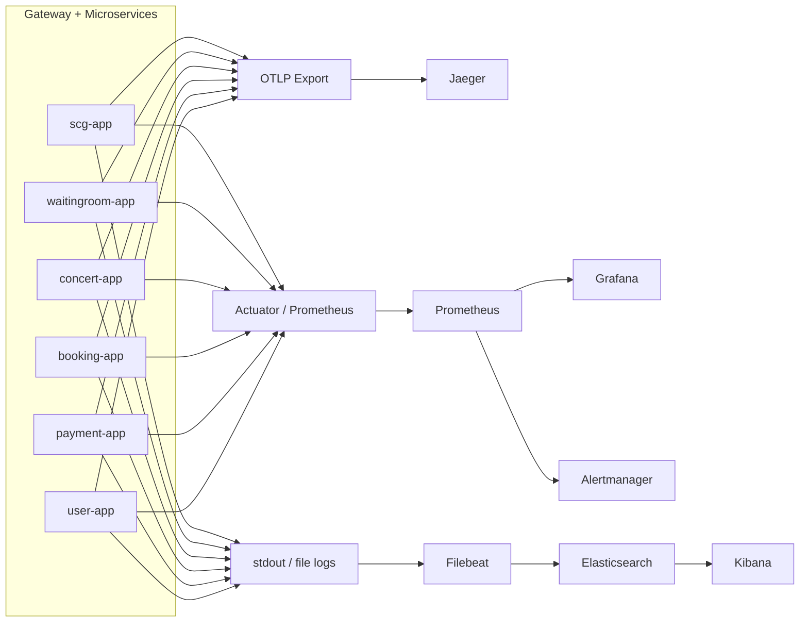

# 05. 모니터링 및 관측성 (Observability)

## 1. 관측성 설계 목표

이 프로젝트에서 관측성은 단순히 “메트릭 대시보드가 있다” 수준이 아닙니다.  
아래 질문에 답할 수 있어야 합니다.

1. 장애가 어디서 시작됐는가
2. 어느 서비스 구간이 가장 느린가
3. 느려진 원인이 HTTP 호출인지, SQL인지, Redis인지
4. 어떤 사용자/요청이 영향을 받았는가
5. 재시도/멱등성/보상 로직이 실제로 어떻게 움직였는가

---

## 2. 관측성 스택

### 로그

- Application logs
- Filebeat
- Elasticsearch
- Kibana

### 메트릭

- Spring Boot Actuator
- Prometheus
- Grafana
- Alertmanager

### 트레이싱

- OpenTelemetry
- Jaeger

### DB/APM

- P6Spy
- Hibernate Statistics
- slow query log
- Prometheus/Grafana DB 지표
- Pinpoint(차기 고도화)

---

## 3. 시그널 수집 구조

---

## 4. 로그 설계

## 4.1 공통 로그 식별자

`scg-app`은 진입 시점에 다음을 정리합니다.

- `X-Correlation-Id`
- `X-Request-Id`

그리고 로그에는 `traceId`, `spanId`, `correlationId`를 함께 남길 수 있게 패턴을 맞췄습니다.

### 왜 중요한가

실제 장애 분석은 보통 아래 순서로 진행됩니다.

1. 사용자가 실패한 요청의 correlationId 확인
2. Kibana에서 correlationId / traceId 검색
3. gateway access log에서 routeId, status, duration 확인
4. Jaeger에서 서비스 hop 분석
5. 필요한 경우 해당 시점의 DB slow query log까지 연결

---

## 4.2 gateway access log

`GatewayAccessLogGlobalFilter`에서 표준화한 필드:

- `routeId`
- `method`
- `path`
- `status`
- `durationMs`
- `correlationId`
- `userId`
- `clientIp`
- `signal`

이 필드는 Kibana에서 매우 유용합니다.

### 바로 쓸 수 있는 검색 예시

- `status >= 500`
- `routeId = payment-service`
- `userId = 100 AND path = /api/v1/payments/confirm`
- `correlationId = <특정 요청 ID>`

---

## 5. 메트릭 설계

## 5.1 애플리케이션 공통 메트릭

- `http.server.requests`
- `jvm.*`
- `process.*`
- `tomcat.*` 또는 `reactor.netty.*`
- `spring.data.repository.*`
- `resilience4j.*`

## 5.2 gateway 전용 메트릭

- `spring.cloud.gateway.requests`
- routeId별 latency
- routeId별 status code 분포
- routeId별 5xx 비율

## 5.3 꼭 봐야 하는 서비스 메트릭

### waitingroom-app

- queue polling 빈도
- token 발급 성공/실패
- rate limit hit
- Redis latency

### concert-app

- seat HOLD 충돌 횟수
- AVAILABLE 좌석 조회 latency
- optimistic lock 충돌 수

### booking-app

- reservation create/cancel/expire 처리량
- 만료 예약 처리 배치 수
- internal API 실패율

### payment-app

- prepare/confirm/cancel 요청 수
- idempotency cache hit
- idempotency in-progress conflict
- PG approve/cancel 실호출 횟수
- compensation triggered count
- reservation sync failure count

---

## 6. 트레이싱 전략

## 6.1 Jaeger

`scg-app`은 OTLP HTTP endpoint(`http://jaeger:4318/v1/traces`)로 trace를 export하도록 설정되어 있습니다.

이 구조의 장점:

- gateway에서 시작한 trace를 서비스 구간별로 확인 가능
- payment -> booking -> concert 흐름처럼 multi-hop 호출을 한 눈에 볼 수 있음
- 특정 요청이 어느 구간에서 오래 걸렸는지 판단 가능

## 6.2 어떤 구간을 특히 봐야 하는가

- `payment confirm`
- `booking create`
- `waitingroom status`
- `seat hold / confirm / release`
- `payment cancel`

이 구간은 상태 전이, 외부 PG 연동, Redis/DB 경합이 동시에 얽힐 수 있어서 trace 가치가 큽니다.

---

## 7. 장애 감지 체계

## 7.1 기본 알림 대상

- 서비스 health check 실패
- routeId별 5xx 비율 급증
- p95/p99 latency 급증
- Redis connection 문제
- JDBC connection pool exhaustion
- slow query 급증
- Jaeger에서 payment confirm span 비정상 증가

## 7.2 대표 알림 룰 예시

### API 오류율

- 최근 5분 payment confirm 5xx 비율 > 3%
- 최근 5분 booking create 409 비율 급증 (경합 이상 신호인지 확인)

### 성능

- `http.server.requests{uri="/api/v1/payments/confirm"}` p95 > 1.5s
- `spring.cloud.gateway.requests{routeId="payment-service"}` p99 > 2s

### 인프라/리소스

- Redis 연결 실패
- DB CPU > 80%
- active JDBC connections가 pool 상한 근접

---

## 8. DB 관측성

## 8.1 P6Spy

도입 목적:

- 실제 실행 SQL 확인
- 바인딩 값 포함 SQL 추적
- traceId와 함께 SQL 로그를 묶어서 해석

권장 적용:

- `booking-app`
- `payment-app`
- `concert-app`
- `user-app`

## 8.2 Hibernate Statistics

도입 목적:

- API 1회 호출당 SQL 횟수 확인
- fetch 패턴/N+1 의심 확인
- entity load/fetch 통계 확인

## 8.3 slow query log

설정 포인트:

- `slow_query_log=ON`
- staging에서는 민감하게 설정
- trace/log와 묶어서 해석

## 8.4 실행계획(EXPLAIN)

체크 습관:

- `type = ALL`인지
- `key`가 null인지
- `rows`가 과도한지
- `Using temporary`, `Using filesort` 여부

---

## 9. Pinpoint를 왜 붙이려 하는가

Jaeger가 서비스 간 HTTP hop을 보는 데 강하다면,  
Pinpoint는 **JVM 내부 + JDBC call tree**를 자세히 보기 좋습니다.

즉, 전략은 아래처럼 가져가면 좋습니다.

- 1차: Jaeger로 서비스 경로 확인
- 2차: Pinpoint로 메서드/JDBC 병목 세부 확인

이렇게 하면 “어느 서비스가 느린가”와 “그 서비스 안에서 어떤 쿼리가 느린가”를 분리해서 볼 수 있습니다.

---

## 10. 운영자가 실제로 장애를 볼 때 순서

1. Grafana에서 latency/오류율 이상 감지
2. Alertmanager 알림 확인
3. gateway access log에서 correlationId, routeId 확인
4. Kibana에서 해당 correlationId 로그 추적
5. Jaeger에서 span 병목 위치 확인
6. DB slow query / P6Spy / EXPLAIN으로 SQL 원인 분석
7. 필요하면 payment failureCode / reservation sync failureCode로 후속 조치

---

## 11. 포트폴리오에 적으면 좋은 표현

- 로그, 메트릭, 트레이스를 각각 따로 두지 않고 correlationId와 traceId를 기준으로 서로 연결되도록 설계했다
- Gateway에서 공통 요청 식별자와 access log를 표준화해 서비스별 장애를 빠르게 추적할 수 있게 했다
- Prometheus/Grafana로 시스템 지표를 수집하고, ELK와 Jaeger로 장애 분석과 원인 추적을 수행할 수 있는 구조를 직접 구성했다
- 결제/예약/좌석 상태 전이와 같은 핵심 흐름은 멱등성, 보상 로직, internal API 호출까지 관측 가능하도록 설계했다