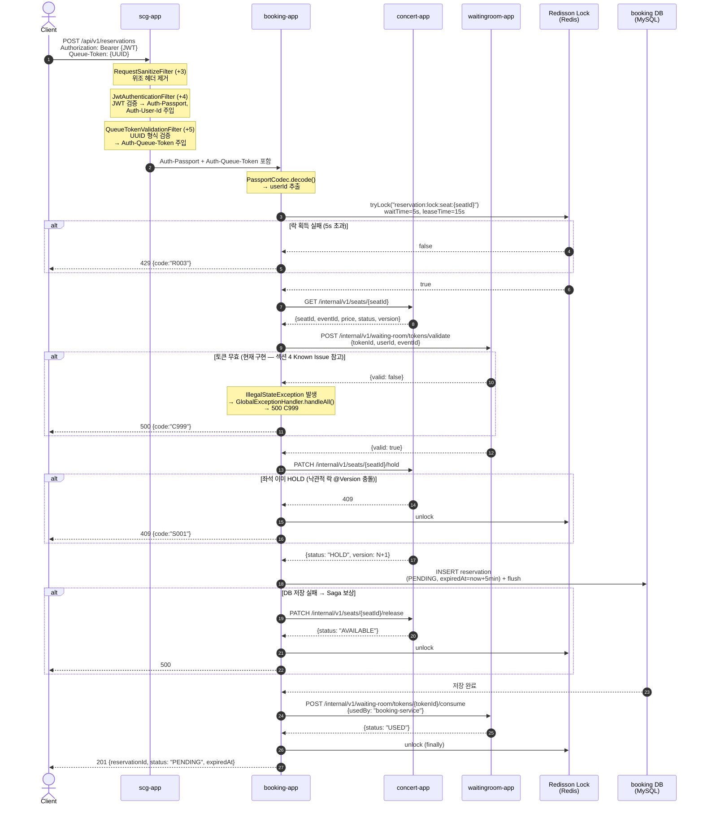

# Booking Flow

예약 생성부터 확정/취소까지의 전체 흐름을 설명합니다.
"현재 구현"과 "의도된 정책(추후 개선)"을 구분해서 기술합니다.

---

## 1. 사전 조건

예약 생성(`POST /api/v1/reservations`)을 호출하기 전 두 가지가 필요합니다.

1. **유효한 JWT 액세스 토큰** — `Authorization: Bearer {token}`
2. **대기열 통과 토큰** — waitingroom-app이 발급한 Queue-Token (UUID v4)

Queue-Token 없이 변이 요청(`POST/PUT/PATCH/DELETE`)을 `/api/v1/reservations/**`에 보내면
SCG에서 즉시 **403** (`QueueTokenValidationFilter`)을 반환합니다.

> **Known Issue — DELETE(예약 취소)에도 Queue-Token이 필요한 현재 동작**
>
> `QueueTokenValidationFilter`의 `PROTECTED_METHODS`가 `POST, PUT, PATCH, DELETE`를 포함하고
> `protectedPaths`가 `/api/v1/reservations/**`이므로,
> `DELETE /api/v1/reservations/{id}` (예약 취소)도 현재 Queue-Token을 요구합니다.
>
> 이는 의도된 정책인지 확인이 필요합니다. 사용자가 대기열을 다시 통과하지 않고도
> 자신의 예약을 취소할 수 있어야 하는 것이 자연스럽기 때문입니다.
>
> **의도된 개선**: `PROTECTED_METHODS`에서 DELETE 제거, 또는 경로 패턴을 POST 전용으로 세분화.

---

## 2. API 엔드포인트

### 2-1. 예약 생성

```
POST /api/v1/reservations

클라이언트가 보내는 헤더:
  Authorization:  Bearer {JWT}
  Queue-Token:    550e8400-e29b-41d4-a716-446655440000  ← UUID v4

Body:
  { "seatId": 10001 }

Response 201:
  {
    "reservationId": 1,
    "userId":        42,
    "seatId":        10001,
    "status":        "PENDING",
    "reservedAt":    "2026-04-01T14:00:00",
    "expiredAt":     "2026-04-01T14:05:00"   ← 생성 시각 +5분
  }
```

`userId`는 클라이언트가 Body에 포함하지 않습니다.
SCG가 JWT에서 추출해 `Auth-Passport` 헤더에 담고,
`ReservationController.extractUserId()`가 `PassportCodec.decode(passportHeader)`로 파싱합니다.

### 2-2. 예약 단건 조회

```
GET /api/v1/reservations/{reservationId}

클라이언트가 보내는 헤더:
  Authorization: Bearer {JWT}
  (Queue-Token 불필요)

Response 200: 위 201 응답과 동일 구조 (ReservationResponseDTO)
```

### 2-3. 내 예약 목록 조회

```
GET /api/v1/users/me/reservations?status=PENDING&page=0&size=20&sort=reservedAt,DESC

클라이언트가 보내는 헤더:
  Authorization: Bearer {JWT}
  (Queue-Token 불필요)

Query Params:
  status  : PENDING | CONFIRMED | CANCELLED (선택, 생략 시 전체)
  page    : 0부터 시작
  size    : 기본 20
  sort    : 기본값 reservedAt, reservationId (DESC)
```

> 이 경로(`/api/v1/users/me/reservations`)는 `user-app`이 아닌 `booking-app`으로 라우팅됩니다.
> SCG `application.yml`에서 booking-service predicates에 포함되어 있습니다.

### 2-4. 예약 취소

```
DELETE /api/v1/reservations/{reservationId}

클라이언트가 보내는 헤더:
  Authorization: Bearer {JWT}
  Queue-Token:   {UUID}   ← ⚠️ 현재 필요 (Known Issue 참고)

Response 200:
  { "reservationId": 1, "status": "CANCELLED" }

조건: PENDING 상태이고 expiredAt이 지나지 않은 예약만 취소 가능
```

---

## 3. 예약 생성 상세 흐름

### 3-1. 시퀀스 다이어그램



### 3-2. 동시성 제어 3단계

| 단계 | 위치 | 기법 | 목적 |
|---|---|---|---|
| 1 | booking-app | Redisson 분산락<br/>`reservation:lock:seat:{seatId}` | 동일 seatId 요청 직렬화 |
| 2 | concert-app | JPA 낙관적 락 (`@Version`) | DB 레벨 race condition 방어 |
| 3 | payment-app | 비관적 락 (`SELECT FOR UPDATE`) | 결제 최종 확정 시 정합성 보장 |

분산락 설계 근거 (`ReservationManager.java` ADR 주석):
- 락 범위를 `seatId` 단위로 설정: userId 기준이면 다른 사용자의 동일 좌석 동시 접근을 막지 못함
- `waitTime=5s`: 초과 시 즉시 429 반환 (클라이언트 빠른 피드백)
- `leaseTime=15s`: SCG booking-service `response-timeout: 15s`와 동기화.
  네트워크/GC 장애로 락 해제 누락 시에도 SCG 타임아웃과 동시에 자동 만료 → 데드락 방지

### 3-3. Saga 보상 트랜잭션

#### 현재 구현

좌석 HOLD 이후 예약 DB 저장이 실패할 경우 concert-app에 좌석 RELEASE를 호출합니다.

```
정상:  좌석 HOLD → DB 저장 → 토큰 CONSUME
보상:  좌석 HOLD → DB 저장 실패 → 좌석 RELEASE (concert-app)
```

보상 자체가 실패할 경우: 원본 예외에 `addSuppressed()`로 보상 예외를 누적한 뒤 원본을 re-throw합니다.
좌석이 HOLD 상태로 고착됩니다.

#### 의도된 개선

- TODO: 보상 실패 시 AlertManager 연동이 현재 미구현. HOLD 상태 고착 감지 알림이 필요합니다.
- TODO: 토큰 CONSUME 실패 시 보상 로직 미구현. (현재 DB 저장 성공 후 CONSUME이 실패해도 예약은 생성됨)

---

## 4. 대기열 토큰 무효 시 응답 — Known Issue

### 현재 동작 (코드 기준)

| 단계 | 동작 |
|---|---|
| booking-app `ReservationManager` | `valid: false` → `throw new IllegalStateException(...)` |
| booking-app `GlobalExceptionHandler` | `handleAll(Exception e)` 매칭 → `ErrorCode.INTERNAL_SERVER_ERROR` |
| 클라이언트 수신 | **500** `{ "code": "C999", "message": "Internal Server Error", "status": 500 }` |
| SCG CB | booking-service CB는 500을 제외하므로 **CB 카운트에 반영하지 않음** |

클라이언트 관점에서 "대기열 토큰이 무효합니다"와 "서버 내부 오류"를 구분할 수 없습니다.

### 의도된 개선

booking-app에서 `IllegalStateException` 대신 `BusinessException(ErrorCode.INVALID_QUEUE_TOKEN)`처럼
전용 비즈니스 예외로 처리해야 합니다. 이렇게 하면:
- 클라이언트가 4xx 에러코드로 정확한 원인을 받을 수 있고
- SCG CB에서 500을 다시 장애 지표로 복원할 수 있습니다
- `application.yml` 주석에도 이 TODO가 명시되어 있습니다

---

## 5. 예약 상태 머신

```
                    ┌─────────┐
             생성 시 │ PENDING │ expiredAt = 생성 시각 + 5분
                    └────┬────┘
                         │
           ┌─────────────┼─────────────┐
           ▼             ▼             ▼
     본인 취소     결제 성공          만료 처리
   (PENDING +    (payment-app      (PENDING +
    not expired)  내부 호출)         expired)
           │             │             │
           ▼             ▼             ▼
      CANCELLED      CONFIRMED     CANCELLED
```

| 상태 | 설명 | 전이 조건 |
|---|---|---|
| `PENDING` | 임시 예약 (결제 대기 중) | 생성 시 기본 상태 |
| `CONFIRMED` | 예약 확정 | payment-app 결제 성공 후 내부 호출 `confirmReservation()` |
| `CANCELLED` | 취소 또는 만료 | 본인 취소(`cancelReservation`) 또는 만료 처리(`expireReservation`) |

> **의도된 개선**: `EXPIRED` 상태가 현재 없습니다. 만료와 취소가 모두 `CANCELLED`로 전이됩니다.
> 추후 `EXPIRED` 상태를 분리할 경우 도메인 `cancel()` / `expire()` 메서드를 분리해야 합니다.
> (`ReservationManager.expireReservation()` 주석: "추후에 EXPIRED 상태를 넣으면 반드시 expire()로 분리해야함")

---

## 6. 에러 코드 (booking 관련)

| 코드 | HTTP | 상황 | 발생 위치 |
|---|---|---|---|
| `R001` | 404 | 존재하지 않는 예약 | `ReservationReader` |
| `R002` | 409 | PENDING이 아니거나 만료된 예약 확정 시도 | `ReservationValidator` |
| `R003` | 429 | 동일 좌석 분산락 경합 | `ReservationManager.createReservation()` |
| `S001` | 409 | 낙관적 락 충돌 — 다른 사용자가 이미 좌석 선택 | `GlobalExceptionHandler` (ObjectOptimisticLockingFailure) |
| `S002` | 404 | 존재하지 않는 좌석 | `SeatNotFoundException` |
| `A001` | 401 | Auth-Passport 디코딩 실패 | `GlobalExceptionHandler` (PassportCodecException) |
| `C999` | 500 | 섹션 4 Known Issue: 토큰 무효 등 미분류 예외 | `GlobalExceptionHandler.handleAll()` |

> 에러 코드의 모듈 소속과 네이밍은 `shared-kernel` 구조 재설계 후 확정 예정입니다.

---

## 검증에 사용한 소스 파일

- `booking-app/.../api/controller/ReservationController.java`
- `booking-app/.../implement/manager/ReservationManager.java`
- `booking-app/.../implement/validator/ReservationValidator.java`
- `booking-app/.../implement/client/WaitingRoomInternalClient.java`
- `booking-app/.../implement/client/impl/WaitingRoomInternalClientImpl.java`
- `booking-app/.../implement/client/ConcertSeatInternalClient.java`
- `booking-app/.../implement/client/impl/ConcertSeatInternalClientImpl.java`
- `booking-app/.../api/request/ReservationCreateRequestDTO.java`
- `booking-app/.../api/response/ReservationResponseDTO.java`
- `booking-app/.../domain/ReservationStatus.java`
- `scg-app/.../filter/QueueTokenValidationFilter.java`
- `scg-app/.../filter/JwtAuthenticationFilter.java`
- `scg-app/src/main/resources/application.yml`
- `common-module/.../error/ErrorCode.java`
- `common-module/.../error/GlobalExceptionHandler.java`
- `common-module/.../gateway/PassportCodec.java`
