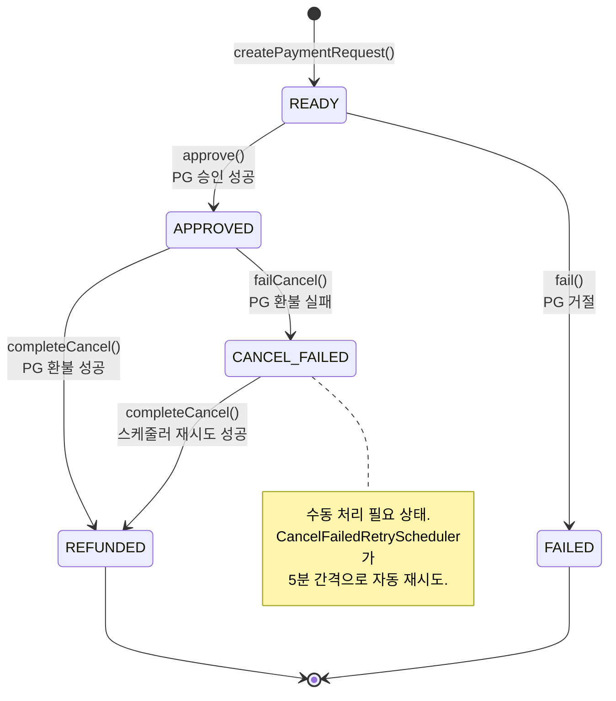
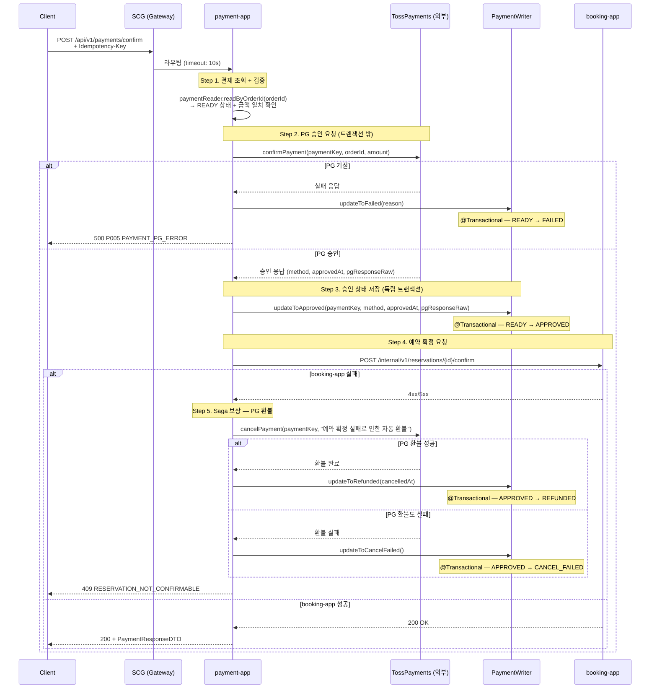

# 결제 실패·보상 흐름 상세

## 1. 문서 범위와 전제

**이 문서가 다루는 것:**
- payment-app 내부의 결제 생성 → 승인 → 실패 → 보상 전체 흐름
- Saga 보상 트랜잭션 3가지 시나리오
- CANCEL_FAILED 자동 복구 스케줄러
- 멱등성(Idempotency-Key) 보장 구조
- 에러 코드 매핑 (P001~P006)

**이 문서가 다루지 않는 것:**
- SCG → payment-app 라우팅 규칙 → `frontend-integration-guide.md` 참조
- booking-app 측 예약 생성·분산락 흐름 → `booking-flow.md` 참조
- TossPayments PG 내부 처리 로직 (외부 시스템)

**전제:**
- 결제 요청은 SCG를 경유하며 `Auth-Passport` 헤더로 사용자를 식별한다.
- booking-app과 concert-app 연동은 nginx_proxy를 경유하는 내부 REST 호출이다.
  (connect timeout: 3s, read timeout: 10s — `RestClientConfig.java`)

---

## 2. 결제 상태 머신



**전이 메서드와 사전 검증** (소스: `Payment.java`):

| 메서드 | 허용 시작 상태 | 결과 상태 | 검증 실패 시 |
|--------|--------------|----------|-------------|
| `approve()` | READY | APPROVED | `IllegalStateException` |
| `fail()` | READY | FAILED | `IllegalStateException` |
| `completeCancel()` | APPROVED, CANCEL_FAILED | REFUNDED | `IllegalStateException` |
| `failCancel()` | APPROVED | CANCEL_FAILED | `IllegalStateException` |

> **Known Issue KI-1:** `PaymentStatus` enum에 `CANCEL_PENDING("취소 요청 중")`이 정의되어 있으나,
> `Payment.java`의 어떤 전이 메서드에서도 이 상태로 변경하는 코드가 없다.
> 현재 도달 불가능한 상태이며, 향후 취소 요청 중간 상태가 필요해지면 활성화할 수 있다.
> — 소스: `PaymentStatus.java:13`, `Payment.java` 전체

---

## 3. 결제 생성 (createPaymentRequest)

**소스:** `PaymentManager.java` — `@Transactional`

```
1. bookingClient.readReservation(reservationId)
   → 예약 상태가 PENDING인지 검증
   → 실패 시: RESERVATION_NOT_FOUND 또는 상태 불일치 예외

2. paymentReader.checkDuplicate(reservationId)
   → 이미 결제가 존재하면: PAYMENT_ALREADY_EXISTS (P002)

3. concertSeatClient.readSeat(seatId)
   → 좌석 가격을 조회 (price of truth)

4. Payment 도메인 생성
   → orderId 포맷: RES{reservationId}_{epochMilli}
   → 상태: READY

5. paymentWriter.save(payment)
   → saveAndFlush()로 UK 위반 즉시 감지
   → UK: reservation_id, order_id
```

---

## 4. 결제 승인 (confirmPayment) — Saga 핵심 구간

**소스:** `PaymentManager.java` — `@Transactional` **없음** (의도적 설계)

> **ADR:** confirmPayment()에 `@Transactional`을 걸지 않은 이유:
> PG 외부 호출(TossPayments)을 기다리는 동안 DB 커넥션을 점유하지 않기 위함.
> 대신 `PaymentWriter`의 개별 메서드가 각각 독립된 `@Transactional`로 동작한다.
> — 소스: `PaymentManager.java:28-32` 주석



---

## 5. Saga 보상 시나리오

### 시나리오 1: PG 거절 (돈이 빠져나가기 전)

| 단계 | 상태 | 설명 |
|------|------|------|
| confirmPayment() 호출 | READY | — |
| TossPayments 거절 | READY → FAILED | `fail(reason)` 호출 |
| **보상 필요 여부** | **불필요** | 고객 계좌에서 출금 자체가 안 됨 |

### 시나리오 2: booking-app 실패 (돈이 빠져나간 후)

| 단계 | 상태 | 설명 |
|------|------|------|
| TossPayments 승인 | READY → APPROVED | PG 측 결제 완료 |
| booking-app 예약 확정 실패 | APPROVED | 4xx/5xx 응답 |
| `initiateRefund()` 호출 | — | PG cancelPayment 요청 |
| PG 환불 성공 | APPROVED → REFUNDED | `completeCancel()` 호출 |
| **결과** | **자동 환불 완료** | 고객에게 자동 환불 |

### 시나리오 3: PG 환불도 실패 (최악의 케이스)

| 단계 | 상태 | 설명 |
|------|------|------|
| TossPayments 승인 | READY → APPROVED | PG 측 결제 완료 |
| booking-app 예약 확정 실패 | APPROVED | — |
| PG 환불 요청도 실패 | APPROVED → CANCEL_FAILED | `failCancel()` 호출 |
| **결과** | **수동 처리 대기** | CancelFailedRetryScheduler가 자동 재시도 |

> **Assumption AS-1:** 시나리오 2, 3에서 booking-app 측 좌석 상태가 어떻게 처리되는지는
> booking-app 코드 추가 검증이 필요하다. confirmReservation() 실패 시 booking-app이
> 좌석을 자동 해제하는지, 별도 보상이 필요한지 현재 미확인.

---

## 6. CANCEL_FAILED 자동 복구

**소스:** `CancelFailedRetryScheduler.java`

```
@Scheduled(fixedDelay = 300_000, initialDelay = 60_000)
```

| 설정 | 값 | 소스 |
|------|-----|------|
| 재시도 간격 | 300,000ms (5분) | `fixedDelay = 300_000` |
| 초기 지연 | 60,000ms (1분) | `initialDelay = 60_000` |
| 최대 재시도 횟수 | **없음** (무제한) | 코드 주석: "최대 재시도 횟수를 두지 않음" |

**처리 흐름:**
1. `paymentReader.readAllByStatus(CANCEL_FAILED)` — 대상 조회
2. 각 건에 대해 `tossPaymentsClient.cancelPayment()` 재시도
3. 성공 시: `updateToRefunded()` → CANCEL_FAILED → REFUNDED
4. 실패 시: CANCEL_FAILED 유지, 다음 주기에 재시도
5. 실패 로그: `[CRITICAL]` 레벨로 기록

> **Known Issue KI-2:** 최대 재시도 횟수가 없으므로 PG 장기 장애 시 CANCEL_FAILED 건이
> 무한 누적될 수 있다. 현재 알림(AlertManager 등)과 연동되어 있지 않아
> 운영자가 수동으로 모니터링해야 한다.

---

## 7. 멱등성 보장 (Idempotency-Key)

**소스:** `IdempotencyManager.java`, `PaymentController.java`

### 적용 대상

| 엔드포인트 | Idempotency-Key | 비고 |
|-----------|:---------------:|------|
| `POST /api/v1/payments/request` | ✅ | `@RequestHeader("Idempotency-Key")` |
| `POST /api/v1/payments/confirm` | ✅ | `@RequestHeader("Idempotency-Key")` |
| `POST /api/v1/payments/{paymentKey}/cancel` | ❌ | 헤더 파라미터 없음 |
| `GET /api/v1/payments/{paymentId}` | — | 읽기 전용, 해당 없음 |

### Redis 기반 처리 흐름

```
Client → Idempotency-Key: {uuid}

1. Redis GET "payment:idempotency:{uuid}"
   ├─ 값 = "PROCESSING"  → 409 P006 (동시 중복 요청)
   ├─ 값 = "{json}"      → 캐시된 응답 반환 (재시도 안전)
   └─ 키 없음            → 계속 진행

2. Redis SETNX "payment:idempotency:{uuid}" = "PROCESSING" (TTL: 24시간)
   └─ Duration.ofHours(24) — IdempotencyManager.java

3. 비즈니스 로직 실행

4-a. 성공 → Redis SET {uuid} = {response JSON} (TTL 유지)
4-b. 실패 → Redis DEL {uuid} (재시도 허용)
```

### 2차 방어: DB 유니크 제약

| 컬럼 | 제약 | 효과 |
|------|------|------|
| `reservation_id` | `uk_reservation_id` | 하나의 예약에 하나의 결제만 |
| `order_id` | `uk_order_id` | TossPayments orderId 전역 유일 |

> **Known Issue KI-3:** `POST /{paymentKey}/cancel`에는 애플리케이션 레벨의
> 취소 요청 멱등성 보호가 적용되어 있지 않다. 네트워크 재시도 시
> 동일 취소 요청이 중복 도달할 수 있으며, 이 경우의 동작은
> PG(TossPayments) 측 멱등성 처리에 의존한다.
> — Assumption: TossPayments cancelPayment API의 멱등성 보장 여부는 미검증.

---

## 8. 에러 코드 매핑

**소스:** `ErrorCode.java`, `PaymentExceptionHandler.java`

| 코드 | HTTP | 이름 | 발생 조건 |
|------|------|------|----------|
| P001 | 404 | PAYMENT_NOT_FOUND | paymentId/orderId로 조회 실패 |
| P002 | 409 | PAYMENT_ALREADY_EXISTS | reservation_id 또는 order_id UK 위반 |
| P003 | 400 | PAYMENT_AMOUNT_MISMATCH | 클라이언트 전송 금액 ≠ DB 저장 금액 |
| P004 | 409 | PAYMENT_INVALID_STATUS | 상태 머신 위반 (예: FAILED에서 approve 시도) |
| P005 | 500 | PAYMENT_PG_ERROR | TossPayments API 호출 실패 |
| P006 | 409 | PAYMENT_IDEMPOTENCY_CONFLICT | 동일 Idempotency-Key로 동시 요청 |

**특수 처리:** `PaymentExceptionHandler`에서 `DataIntegrityViolationException`을
P002로 매핑하여, Redis 멱등성 체크를 통과했더라도 DB UK에서 최종 방어한다.

---

## 9. Known Issues & Assumptions 종합

### Known Issues

| ID | 항목 | 영향 | 소스 |
|----|------|------|------|
| KI-1 | `CANCEL_PENDING` 도달 불가 | enum 정의만 존재, 상태 전이 코드 없음 | `PaymentStatus.java:13` vs `Payment.java` |
| KI-2 | 스케줄러 무한 재시도 + 알림 미연동 | PG 장기 장애 시 CANCEL_FAILED 누적, 수동 모니터링 필요 | `CancelFailedRetryScheduler.java` |
| KI-3 | `/cancel` 엔드포인트 멱등성 미보호 | 애플리케이션 레벨 중복 요청 방어 없음, PG 측 처리에 의존 | `PaymentController.java` |

### Assumptions

| ID | 항목 | 검증 필요 사항 |
|----|------|--------------|
| AS-1 | Saga 시나리오 2,3에서 booking-app 좌석 해제 여부 | booking-app의 confirmReservation 실패 시 롤백 동작 확인 필요 |
| AS-2 | PG read timeout(10s) 초과 시 결제 상태 | payment-app에서 READY 잔류, PG 측 실제 승인 여부 불확실 → 정합성 갭 가능 |
| AS-3 | TossPayments cancelPayment API 멱등성 | PG 측에서 동일 paymentKey 중복 취소를 어떻게 처리하는지 미검증 |

---

## 10. 검증 소스 파일 목록

| 파일 | 검증 내용 |
|------|----------|
| `payment-app/.../domain/Payment.java` | 상태 전이 메서드 4개, 사전 검증 로직 |
| `payment-app/.../domain/PaymentStatus.java` | enum 6개 값 (CANCEL_PENDING 포함) |
| `payment-app/.../implement/manager/PaymentManager.java` | 결제 생성·승인·보상 흐름, 트랜잭션 경계 주석 |
| `payment-app/.../implement/idempotency/IdempotencyManager.java` | Redis TTL `Duration.ofHours(24)`, PROCESSING 플래그 |
| `payment-app/.../implement/scheduler/CancelFailedRetryScheduler.java` | `@Scheduled(fixedDelay=300_000, initialDelay=60_000)`, 무제한 재시도 |
| `payment-app/.../api/controller/PaymentController.java` | Idempotency-Key 적용 범위 (request, confirm만) |
| `payment-app/.../global/config/RestClientConfig.java` | connect 3s, read 10s |
| `payment-app/.../global/error/ErrorCode.java` | P001~P006 정의 |
| `payment-app/.../global/exception/PaymentExceptionHandler.java` | DataIntegrityViolation → P002 매핑 |
| `payment-app/.../implement/client/impl/BookingInternalClientImpl.java` | 예약 조회·확정 HTTP 클라이언트, 에러 매핑 |
| `payment-app/.../implement/client/impl/TossPaymentsClientImpl.java` | PG confirm/cancel API 호출 |
| `payment-app/.../storage/entity/PaymentEntity.java` | UK 제약 (reservation_id, order_id), 인덱스 |
| `payment-app/.../implement/manager/PaymentManagerTest.java` | Saga 3 시나리오 단위 테스트 |
