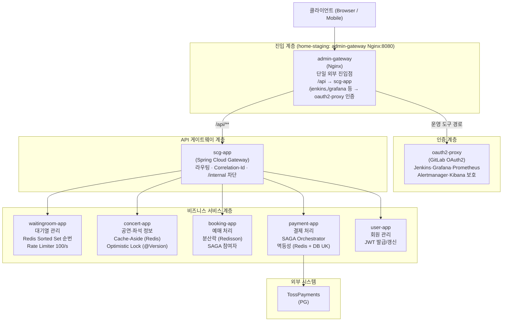
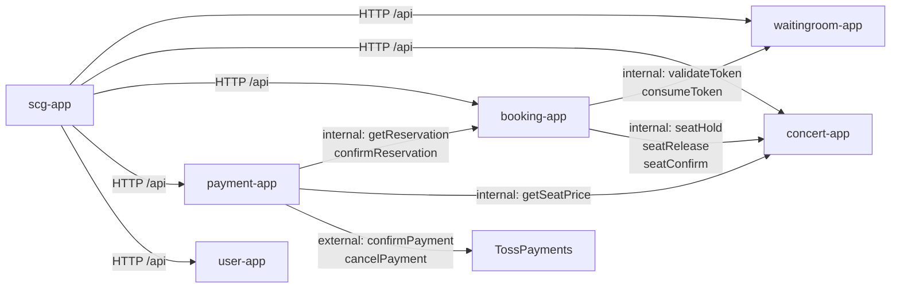
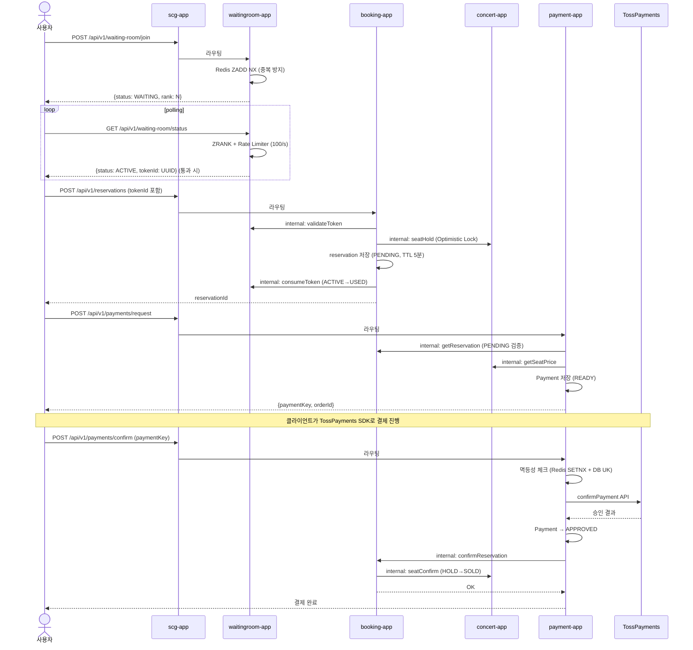
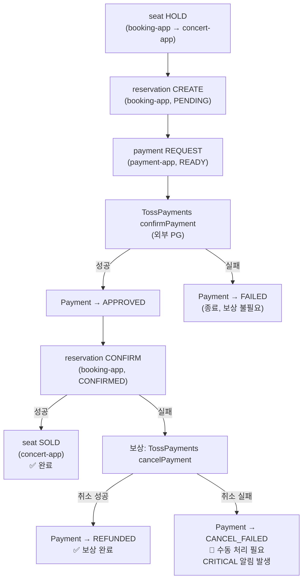
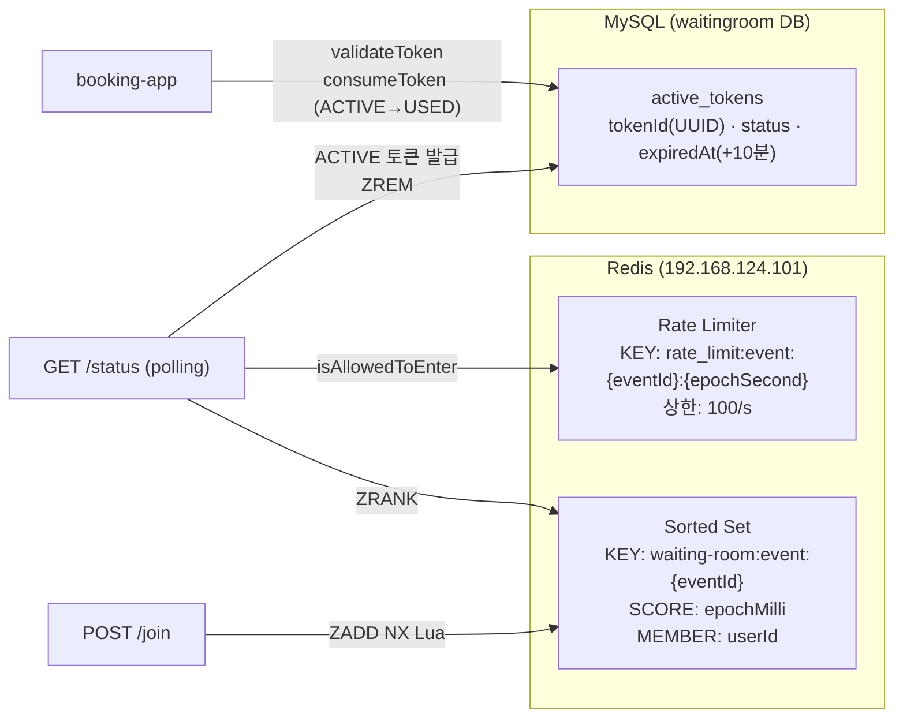
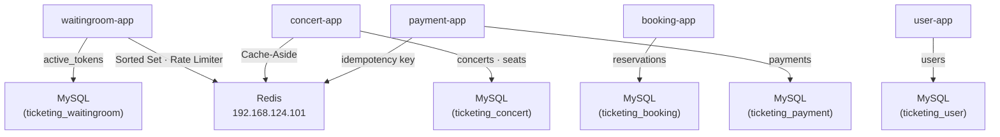
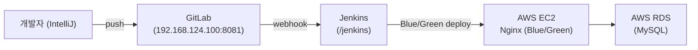
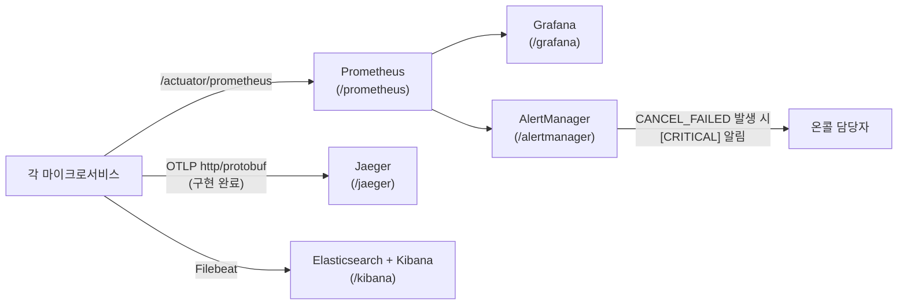

## 목차

- [시스템 개요](#시스템-개요)
- [서비스 구성](#서비스-구성)
- [서비스 간 통신 흐름](#서비스-간-통신-흐름)
- [핵심 사용자 흐름 (Sequence)](#핵심-사용자-흐름-sequence)
- [결제 Saga 흐름](#결제-saga-흐름)
- [대기열 설계 요약](#대기열-설계-요약)
- [동시성 제어 전략](#동시성-제어-전략)
- [데이터 저장소 구성](#데이터-저장소-구성)
- [인프라 및 배포](#인프라-및-배포)
- [관측성 스택](#관측성-스택)
- [설계 결정 핵심 요약](#설계-결정-핵심-요약)

---

# System Overview: MSA 기반 티켓팅 플랫폼 전체 아키텍처

> 이 문서는 전체 시스템의 **조감도(bird's-eye view)**를 제공합니다. 각 서비스의 세부 설계는 해당 문서를 참조하세요.

---

## 시스템 개요

MSA 기반 대규모 티켓팅 시스템입니다. 오픈 직후 수천 명이 동시에 좌석 선점을 시도하는 **트래픽 폭증**, **좌석 중복 예약 방지**, **결제 정합성** 세 가지 과제를 서비스 분리와 설계 패턴으로 해결합니다.

```
기술 스택: Java 21 · Spring Boot 3.x · Spring Cloud Gateway
           Kafka · Redis · MySQL · Docker
빌드:      Gradle
부하 테스트: k6
CI/CD:    GitLab → Jenkins → AWS EC2 Nginx (Blue/Green) → AWS RDS (MySQL)
```

---

## 서비스 구성



### 서비스별 핵심 책임

| 서비스 | 핵심 책임 | 주요 기술 |
|--------|----------|----------|
| `scg-app` | 라우팅, 인증 필터, Correlation ID 전파, `/internal` 경로 차단 | Spring Cloud Gateway, oauth2-proxy |
| `user-app` | 회원 가입/로그인, JWT 발급·갱신 | Spring Security, JWT |
| `waitingroom-app` | 대기열 입장 순서 관리, throughput 제어, 입장 토큰 발급 | Redis Sorted Set, WebFlux, ReactiveRedisTemplate |
| `concert-app` | 공연 정보·좌석 조회, 좌석 상태 관리 (HOLD/RELEASE/SOLD) | JPA Optimistic Lock (@Version), Redis Cache-Aside |
| `booking-app` | 예약 생성·확정·취소, 토큰 검증, 좌석 선점 조율 | Redisson 분산락, 5분 TTL 스케줄러 |
| `payment-app` | 결제 요청·confirm·취소, Saga 오케스트레이션, 멱등성 보장 | TossPayments REST, Redis SETNX, DB UNIQUE KEY |

---

## 서비스 간 통신 흐름



**의존성 방향 원칙 (단방향):**

```
payment-app → booking-app → concert-app
                          → waitingroom-app
payment-app → concert-app
```

- `concert-app`, `waitingroom-app`, `user-app` 은 다른 내부 서비스를 호출하지 않는 **leaf service**
- 역방향 호출 없음 → 순환 의존 없음
- 서비스 간 통신: **동기 RestClient** (connect 3s / read 10s 타임아웃)

---

## 핵심 사용자 흐름 (Sequence)



---

## 결제 Saga 흐름

payment-app이 결제 confirm 전체 흐름을 **오케스트레이션**합니다.



### 멱등성 2중 방어

```
1차: Redis SETNX  idempotency:{reservationId}:{orderId}  (TTL 10분)
     → 이미 PROCESSING 중인 동일 요청 즉시 차단
2차: DB UNIQUE KEY (reservation_id, order_id)
     → Redis 장애 시에도 중복 처리 방지
```

---

## 대기열 설계 요약



**핵심 설계 선택:**

- **Redis Sorted Set**: ZADD O(log N), 이벤트 종료 후 TTL 자동 소멸
- **ZADD NX Lua 스크립트**: 원자적 중복 진입 차단
- **UUID 토큰**: Long Auto Increment는 예측 가능 → 타인 토큰 유추 공격 방지
- **ReactiveRedisTemplate (WebFlux)**: polling 집중 트래픽에서 Tomcat thread 고갈 방지

---

## 동시성 제어 전략

| 계층 | 전략 | 적용 위치 | 목적 |
|------|------|----------|------|
| 대기열 중복 진입 방지 | `ZADD NX` Lua 스크립트 | `waitingroom-app` | 같은 사용자의 중복 큐 진입 원자적 차단 |
| 좌석 중복 예약 방지 | JPA `@Version` (Optimistic Lock) | `concert-app` | 좌석 HOLD/SOLD 동시 실행 시 버전 충돌 감지 |
| 예약 처리 직렬화 | Redisson 분산락 | `booking-app` | 동일 좌석에 대한 동시 예약 요청 순차 처리 |
| 결제 중복 처리 방지 | Redis SETNX + DB UNIQUE KEY | `payment-app` | 동일 결제 confirm 요청 2중 방어 |
| 결제 최종 확정 | JPA 비관적 락 (planned) | `payment-app` | 최종 상태 변경 시 경합 방지 |

---

## 데이터 저장소 구성

**Database per Service 패턴** — 서비스 간 DB 공유 없음



| 저장소 | 용도 | 비고 |
|--------|------|------|
| MySQL (서비스별) | 예약·결제·좌석·회원 영속 데이터 | AWS RDS (prod), Docker Compose (local) |
| Redis | 대기열 순번, Cache-Aside, 멱등성 키 | 에코비 A1 N100 전용 서버 (192.168.124.101) |

---

## 인프라 및 배포



**Blue/Green 배포 전략:**
- Nginx upstream 전환으로 무중단 배포
- 이전 버전(Green)은 롤백 대기 상태 유지
- 롤백 절차: Nginx upstream을 Green으로 재전환

**보안 구조:**
- 2중 NAT (LG8550 → LG63A7) + OpenVPN 강제 접속
- GitLab OAuth2 + 2중 MFA (Google Authenticator + Bitwarden OTP)
- oauth2-proxy(4180)로 내부 서비스 접근 제한
- SCG에서 `/internal/**` 경로 외부 노출 차단

---

## 관측성 스택



| 항목 | 구현 상태 | 설명 |
|------|----------|------|
| 분산 추적 (TraceId/SpanId) | ✅ 구현 | `micrometer-tracing-bridge-brave`, MDC 자동 주입 |
| Prometheus 메트릭 노출 | ✅ 구현 | `/actuator/prometheus`, 서비스별 태그 (`application="*-service"`) |
| Grafana 대시보드 | ✅ 구현 | `management.metrics.tags.application` 서비스별 필터링 |
| AlertManager | ✅ 구현 | `PaymentCancelFailed` alert (`payment_confirm_total{result="cancel_failed"}`) |
| Jaeger 분산 트레이스 | ✅ 구현 (home-staging) | OTel Agent OTLP `http://jaeger:4318`, 6개 서비스 모두 설정 완료 |
| ELK 로그 파이프라인 | ✅ 구현 | Filebeat → Elasticsearch → Kibana |
| k6 부하 테스트 | 🔄 진행 중 | `ci-cd-test/load-test/scripts/` 관리 |

**핵심 메트릭 (`payment-app`):**

```promql
# 결제 성공률 (SLO 목표: 99.9%)
rate(payment_confirm_total{result="success"}[5m])
  / (rate(payment_confirm_total{result="success"}[5m])
     + rate(payment_confirm_total{result="pg_error"}[5m]))

# CANCEL_FAILED 발생 건수 (Alert 기준: 1시간 내 1건 이상)
increase(payment_confirm_total{result="cancel_failed"}[1h])
```

> 메트릭 명칭 통일 결정은 [ADR 0001](adr/0001-single-counter-metric-naming.md)을 참고합니다.

---

## 설계 결정 핵심 요약

| 결정 | 채택 방식 | 핵심 이유 |
|------|----------|---------|
| 서비스 분리 | MSA (6 서비스) | 피크 트래픽 시 waitingroom-app만 집중 스케일아웃 |
| 서비스 간 통신 | 동기 RestClient | 결제 흐름의 정합성 추적 용이, 현 단계 비동기 전환 시 보상 복잡도 증가 |
| 대기열 자료구조 | Redis Sorted Set | O(log N) ZADD/ZRANK, 이벤트 종료 후 자동 소멸 |
| 좌석 동시성 제어 | Optimistic Lock (@Version) + Redisson 분산락 | 낙관적 락으로 충돌 감지, 분산락으로 booking 직렬화 |
| 결제 트랜잭션 | Saga Orchestration (payment-app 중심) | payment-app이 전체 흐름 제어, 보상 로직 명확화 |
| 멱등성 | Redis SETNX + DB UNIQUE KEY 2중 방어 | Redis 장애에도 DB UK가 최후 방어선 |
| DB 분리 | Database per Service | 배포·장애 독립성, 서비스 간 물리적 격리 |
| 메트릭 명칭 | 단일 counter + result 레이블 | PromQL 집계 단순화, 신규 result 추가 시 기존 쿼리 유지 |

---

*세부 서비스 설계 문서: [docs/README.md](../README.md) 참조*
