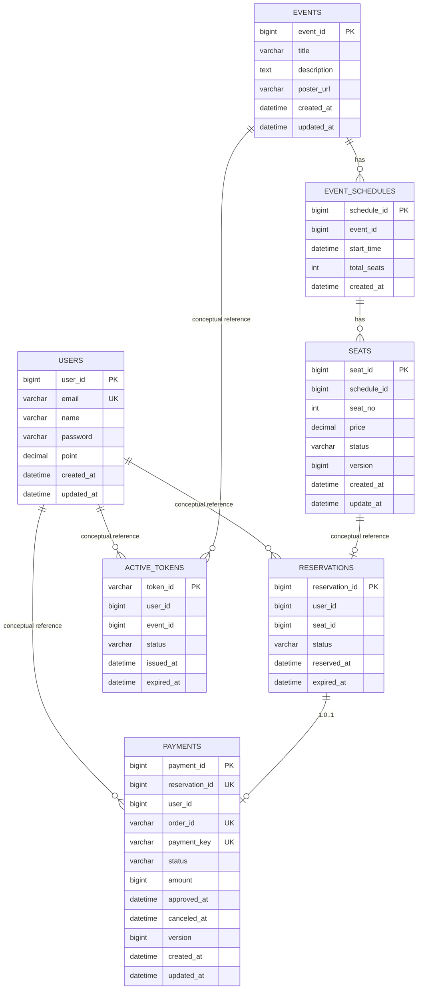

## 목차
- [Background](#background)
- [Problem](#problem)
- [Design](#design)
- [Redis 키 패턴](#redis-키-패턴)
- [무엇을 캐시하지 않는가](#무엇을-캐시하지-않는가)
- [Trade-offs](#trade-offs)
- [Failure Scenarios](#failure-scenarios)
- [Observability](#observability)
- [Interview Explanation (90s version)](#interview-explanation-90s-version)

# Database & Cache Design: 실제 구현 기준

> 이 문서는 **실제 JPA 엔티티와 Redis 키 패턴**을 기준으로 작성합니다.
> 파티셔닝 전략, 인덱스 체크리스트, 시스템 전체 ERD 등 설계 원칙은 이 문서 하단 섹션에 통합되어 있습니다.

---

## Background

서비스별 스키마 분리 원칙을 따릅니다. 5개 서비스가 각자 스키마를 소유하며, 서비스 간 FK를 물지 않습니다. 대신 ID 참조 + internal API로 정합성을 관리합니다.

| 스키마 | 소유 서비스 | 테이블 |
|--------|-----------|--------|
| `ticketing_user` | user-app | users |
| `ticketing_concert` | concert-app | events, event_schedules, seats |
| `ticketing_booking` | booking-app | reservations |
| `ticketing_payment` | payment-app | payments |
| `ticketing_waitingroom` | waitingroom-app | active_tokens |

---

## Problem

결제 데이터 설계에서 해결해야 하는 문제:

1. **이중 결제 방지**: 같은 예약에 두 번 결제 레코드가 생기면 안 됨
2. **PG 정합성**: TossPayments의 orderId, paymentKey가 시스템 내에서 유일해야 함
3. **감사(Audit) 요구**: 결제 분쟁 시 PG 원문 응답이 필요
4. **상태 추적**: 보상 실패(CANCEL_FAILED) 같은 이상 상태를 즉시 탐지

---

## Design

### payments 테이블 DDL

`PaymentEntity.java` 기준 실제 생성 DDL:

```sql
CREATE TABLE ticketing_payment.payments (
    payment_id      BIGINT          NOT NULL AUTO_INCREMENT,
    reservation_id  BIGINT          NOT NULL,
    user_id         BIGINT          NOT NULL,
    order_id        VARCHAR(64)     NOT NULL,
    payment_key     VARCHAR(200)    NULL,           -- PG 승인 전까지 NULL
    amount          DECIMAL(10, 0)  NOT NULL,
    status          VARCHAR(20)     NOT NULL,
    method          VARCHAR(20)     NULL,
    fail_reason     VARCHAR(500)    NULL,
    pg_response_raw TEXT            NULL,           -- PG 응답 원문 (감사용)
    approved_at     DATETIME        NULL,
    cancelled_at    DATETIME        NULL,
    created_at      DATETIME        NOT NULL,
    updated_at      DATETIME        NOT NULL,

    PRIMARY KEY (payment_id),

    -- 이중 결제 방지: 예약 1건당 결제 1건
    CONSTRAINT uk_reservation_id UNIQUE (reservation_id),

    -- TossPayments 주문번호 중복 방지
    CONSTRAINT uk_order_id UNIQUE (order_id),

    -- 인덱스
    INDEX idx_user_id (user_id),
    INDEX idx_status (status)
);
```

**설계 결정 근거:**

| 제약 | 이유 |
|------|------|
| `uk_reservation_id` | `reservationId`는 1:1 결제 보장. Idempotency-Key 없이도 2차 방어 |
| `uk_order_id` | 같은 orderId로 TossPayments에 이중 승인 시 결제 레코드 중복 방지 |
| `payment_key NULL` | READY 상태에서는 PG 미호출이므로 paymentKey 없음. NULL 허용 UK는 MySQL에서 중복 허용 |
| `pg_response_raw TEXT` | PG 분쟁 시 원문 필요. 스토리지 비용 << 분쟁 처리 비용 |
| `amount DECIMAL(10,0)` | 원화(KRW)는 소수점 없음. 정밀도 손실 없이 정수 처리 |

**payment_key에 UK를 별도로 추가하지 않은 이유:**

원래 설계에서 `uk_payment_key`를 추가했으나, `payment_key`는 NULL 허용 컬럼입니다. MySQL에서 NULL 값은 UNIQUE 제약에서 중복으로 처리되지 않으므로 여러 READY 레코드가 `payment_key = NULL`인 상태가 가능합니다. 대신 TossPayments의 paymentKey는 PG가 전역 유일하게 관리하며, `uk_order_id`로 동일 orderId 재사용이 이미 차단됩니다.

---

### reservations 테이블 (booking-app 소유, 참고용)

```sql
-- ReservationEntity.java 기준 (booking-app 소유, payment-app은 internal API로만 접근)
CREATE TABLE ticketing_booking.reservations (
    reservation_id  BIGINT      NOT NULL AUTO_INCREMENT,
    user_id         BIGINT      NOT NULL,
    seat_id         BIGINT      NOT NULL,
    status          VARCHAR(20) NOT NULL DEFAULT 'PENDING',
    reserved_at     DATETIME    NOT NULL,
    expired_at      DATETIME    NOT NULL,

    PRIMARY KEY (reservation_id),
    INDEX idx_user_id (user_id),
    INDEX idx_status_expired (status, expired_at)
);
```

payment-app이 이 테이블에 직접 접근하지 않습니다. booking-app의 `/internal/v1/reservations/{id}`로만 접근합니다.

---

### 상태 전이와 DB 업데이트 매핑

`PaymentWriter.java` 각 메서드가 독립 `@Transactional`로 실행됩니다:

| 메서드 | 상태 전이 | 변경 컬럼 |
|--------|----------|----------|
| `save(payment)` | → READY | 전체 insert |
| `updateToApproved(...)` | READY → APPROVED | payment_key, method, approved_at, pg_response_raw, status |
| `updateToFailed(...)` | READY → FAILED | fail_reason, status |
| `updateToRefunded(...)` | APPROVED → REFUNDED | cancelled_at, status |
| `updateToCancelFailed(...)` | APPROVED → CANCEL_FAILED | status |

모든 update 메서드는 `paymentId`로 entity를 새로 조회합니다. 이전 단계 트랜잭션이 커밋된 후 새 트랜잭션이 시작되므로, 교차 트랜잭션 엔티티 오염이 없습니다.

---

## Redis 키 패턴

### 1. Payment Idempotency

`IdempotencyManager.java`:

```
KEY: payment:idempotency:{idempotencyKey}
TTL: 24시간
TYPE: String

값의 생명주기:
  [처음] 키 없음
  [처리 시작] SETNX → "PROCESSING"
  [처리 완료] SET → "{\"paymentId\":50001, ...}" (응답 JSON)
  [처리 실패] DEL → 키 삭제 (재시도 가능)
```

**Redis 명령 예시:**
```
SETNX payment:idempotency:pay-req-90001-uuid-v1 PROCESSING
EXPIRE payment:idempotency:pay-req-90001-uuid-v1 86400
GET payment:idempotency:pay-confirm-50001-uuid-v1
SET payment:idempotency:pay-confirm-50001-uuid-v1 '{"paymentId":50001,...}' EX 86400
```

### 2. 대기열 (waitingroom-app 소유, 참고용)

```
KEY: waiting-room:event:{eventId}
TYPE: Sorted Set
MEMBER: userId
SCORE: 진입 시각 epoch
```

### 3. Rate Limiting (waitingroom-app 소유, 참고용)

```
KEY: rate_limit:event:{eventId}:{epochSecond}
TYPE: String (counter)
TTL: 2초
```

---

## 무엇을 캐시하지 않는가

| 데이터 | Redis 캐시 여부 | 이유 |
|--------|----------------|------|
| payment.status | **X** | 결제 상태는 DB가 source of truth. 돈이 관련된 상태는 ACID 보장 필수 |
| payment.amount | **X** | 금액 위변조 방지를 위해 DB 단독 관리 |
| reservation.status | **X** | 예약 확정/취소 상태는 DB authoritative |
| seat.status | **X** | 좌석 재고는 DB optimistic lock으로 관리 |
| idempotency key | **O** | TTL 자동 만료, 높은 읽기 빈도, 임시 데이터 |
| 대기열 순번 | **O** | 실시간 순번 계산이 필요하고 TTL 만료가 자연스러움 |
| 이벤트/공연 정보 (planned) | **O** | read-heavy, 변경 빈도 낮음 → L1(Caffeine) + L2(Redis) 적합 |

---

## Trade-offs

| 결정 | 얻은 것 | 잃은 것 |
|------|---------|---------|
| DB UK(reservation_id, order_id) | Redis 없이도 중복 결제 방지 | UK 위반 전에 PG 호출이 일어날 수 있음 (Redis가 없으면) |
| pg_response_raw TEXT 컬럼 | PG 분쟁 대응 가능, 디버깅 정보 보존 | 레코드당 수 KB 저장 |
| DECIMAL(10,0) for amount | 정수 원화 금액 정확 처리 | 다국통화 확장 시 DECIMAL(15,2) 또는 별도 컬럼 필요 |
| Idempotency 키를 Redis에 저장 | 빠른 중복 체크, TTL 자동 만료 | Redis 장애 시 idempotency 검사 불가 (DB UK가 fallback) |
| 서비스별 스키마 분리 | 배포/장애 독립성 | 서비스 간 JOIN 불가, 정합성은 애플리케이션에서 보장 |

---

## Failure Scenarios

### Redis 장애 시 idempotency 처리
1. `IdempotencyManager.startProcessing()` 에서 RedisException 발생
2. 현재 구현: Exception이 상위로 전파되어 500 에러 반환
3. **개선 방안 (planned)**: Redis 장애 시 idempotency 체크를 skip하고 DB UK에 fallback
   - 이 경우 PG 이중 호출이 일어날 수 있으나 DB UK가 최종 방어

### DB UK 위반 (DataIntegrityViolationException)
- `GlobalExceptionHandler`에서 `P002` 에러로 변환
- 이미 결제가 존재하는 예약에 대한 두 번째 요청을 막음

### CANCEL_FAILED 상태 잔류
```sql
-- 수동 조회
SELECT * FROM ticketing_payment.payments WHERE status = 'CANCEL_FAILED';
-- 모니터링: idx_status 인덱스로 빠른 조회 가능
```

---

## Observability

**idx_status 인덱스의 운영 활용:**
```sql
-- 이상 상태 모니터링 (CANCEL_FAILED)
SELECT payment_id, reservation_id, order_id, payment_key, created_at
FROM ticketing_payment.payments
WHERE status = 'CANCEL_FAILED'
ORDER BY created_at DESC;

-- READY 상태 장시간 잔류 감지 (PG 타임아웃 의심)
SELECT payment_id, order_id, created_at
FROM ticketing_payment.payments
WHERE status = 'READY'
  AND created_at < NOW() - INTERVAL 10 MINUTE;
```

**Grafana 메트릭 태그:**
- `management.metrics.tags.application=payment-service` 설정으로 Grafana에서 payment-service 단독 필터링 가능

---

## Interview Explanation (90s version)

> 결제 테이블 설계에서 핵심은 세 가지 UNIQUE 제약입니다. `reservation_id`로 같은 예약에 이중 결제 레코드를 막고, `order_id`로 TossPayments 주문번호 중복을 방지합니다. Redis의 Idempotency 키가 1차 방어고, DB UK가 2차 방어입니다. Redis 장애 시에도 DB UK가 최종 안전망 역할을 합니다. 결제 상태와 금액은 DB만 source of truth로 관리하고, Redis는 대기열·rate limiting·idempotency 같이 TTL 자동 만료가 자연스러운 데이터에만 사용합니다.

---

---

## 시스템 전체 DB 설계 원칙

### 설계 원칙

이 프로젝트의 DB 설계는 **서비스별 schema 분리 + ID 참조 기반**을 기본 원칙으로 둡니다.

- `ticketing_user`
- `ticketing_concert`
- `ticketing_booking`
- `ticketing_payment`
- `ticketing_waitingroom`

마이크로서비스 경계 때문에 **서비스 간 FK를 강하게 물지 않고**, 각 서비스가 자기 DB/스키마의 source of truth를 갖습니다. 서비스 간 관계는 **물리 FK**가 아니라 **개념적 참조(conceptual reference)**로 관리합니다.

---

### 개념 ERD



**해석 포인트:**
- `reservations → payments`는 비즈니스적으로 1:1. `payments.reservation_id` unique로 강제합니다.
- `seats`는 `schedule_id + seat_no` unique로 같은 회차 내 중복 좌석을 막습니다.
- `payments.order_id`, `payments.payment_key`는 외부 PG 정합성을 위해 unique입니다.
- `active_tokens`는 `token_id`를 UUID 문자열로 두어 예측 가능성을 낮춥니다.

---

### 테이블 요약

| Service | Schema | Table | 역할 |
| --- | --- | --- | --- |
| user-app | ticketing_user | users | 사용자 기본 정보 및 포인트 |
| concert-app | ticketing_concert | events | 공연 카탈로그 |
| concert-app | ticketing_concert | event_schedules | 공연 회차 |
| concert-app | ticketing_concert | seats | 좌석 재고 / HOLD / SOLD |
| booking-app | ticketing_booking | reservations | 임시 예약 및 확정 상태 |
| payment-app | ticketing_payment | payments | 결제/환불 상태 |
| waitingroom-app | ticketing_waitingroom | active_tokens | 입장 가능 토큰 |

---

### 현재 인덱스 설계

| Table | 현재 인덱스 / 제약 | 목적 |
| --- | --- | --- |
| `users` | `UK(email)` | 중복 가입 차단, 로그인/식별 조회 |
| `event_schedules` | `IDX(event_id, start_time)` | 특정 공연의 회차 목록 조회 최적화 |
| `seats` | `UK(schedule_id, seat_no)` | 회차 내 좌석 중복 방지 |
| `seats` | `@Version` | 낙관적 락으로 동시 좌석 선점 제어 |
| `reservations` | `IDX(user_id)` | 내 예약 목록 조회 |
| `reservations` | `IDX(status, expired_at)` | 만료 예약 배치 및 상태 기반 조회 |
| `payments` | `UK(order_id)` | PG 주문번호 정합성 |
| `payments` | `UK(reservation_id)` | 예약 1건당 결제 1건 |
| `payments` | `UK(payment_key)` | PG 승인 결과 중복 반영 방지 |
| `payments` | `IDX(user_id)` | 내 결제 조회 |
| `payments` | `IDX(status)` | 상태별 모니터링/운영 조회 |
| `payments` | `IDX(reservation_id, user_id)` | 예약-결제 ownership 조회 |
| `active_tokens` | `IDX(token_id)` | 토큰 상세 조회 |
| `active_tokens` | `IDX(user_id, event_id)` | 중복 발급 방지 / 기존 토큰 조회 |

---

### 추가로 권장하는 인덱스

**`seats(schedule_id, status, seat_no)`**

현재 `AVAILABLE 좌석 조회`는 `scheduleId + status` 조건이 핵심입니다. 좌석 수가 많아지면 아래 인덱스를 추가하는 것이 좋습니다.

```sql
CREATE INDEX idx_seat_schedule_status_no
ON ticketing_concert.seats (schedule_id, status, seat_no);
```

**`reservations(user_id, status, reserved_at desc)`**

내 예약 목록을 상태와 최근순으로 자주 본다면 아래 인덱스가 유리합니다.

```sql
CREATE INDEX idx_reservation_user_status_reserved
ON ticketing_booking.reservations (user_id, status, reserved_at);
```

**`payments(user_id, created_at desc)` 또는 `(user_id, status, approved_at)`**

사용자별 결제 이력 조회가 늘어나면 ordering까지 고려한 인덱스를 추가할 수 있습니다.

---

### 파티셔닝 전략

**현재 상태**: 현재 코드에는 **실제 MySQL 파티셔닝이 구현되어 있지 않습니다.** 현재는 인덱스 최적화 중심으로 운영합니다.

**미래 확장 전략**: 월 단위 range partition 후보는 `ticketing_payment.payments`, `ticketing_booking.reservations`입니다. 시간 기반 생성이 명확하고, 운영 조회·정산·이력성 보관이 자연스러우며, 특정 월 데이터 purge/archive가 쉽습니다.

> 현재는 단일 테이블 + 인덱스 최적화로 운영하고 있으며, 트래픽이 증가하는 단계에서는 `payments.created_at`, `reservations.reserved_at` 기준 월 단위 range partition을 도입할 수 있도록 설계를 열어 두었습니다.

파티셔닝을 지금 당장 하지 않는 이유: 데이터 규모가 작을 때는 파티션 관리 비용이 더 크고, 잘못된 파티셔닝은 오히려 쿼리/운영 복잡도를 높일 수 있습니다.

---

### 정합성 전략

**예약 생성 정합성**: `waiting token validate → seat HOLD → reservation save → token consume`
- 중간 실패 시 seat RELEASE 보상
- token consume은 예약 저장 이후에 실행

**결제 승인 정합성**: `payment prepare → Toss confirm → payment DONE → booking confirm → seat SOLD`
- booking confirm 실패 시 자동 환불 보상 시도
- 이미 승인된 payment 재조회 시 booking 상태를 재검증하여 회복 로직 수행

**결제 취소 정합성**: `payment cancel → booking cancel-confirmed → seat RELEASE`
- booking cancel 동기화 실패 시 `PAYMENT_RESERVATION_SYNC_FAILED`로 표시
- 운영자가 재처리할 수 있도록 failureCode/failureMessage를 DB에 남김

---

### DB 최적화 체크리스트

- `EXPLAIN`에서 `type = ALL`인지 확인
- `possible_keys`는 있는데 `key = null`인지 확인
- `rows`가 예상보다 큰지 확인
- `Using temporary`, `Using filesort` 여부 확인
- slow query log와 traceId를 연결해서 해석
- P6Spy/Hibernate Statistics로 SQL 수와 ORM fetch 패턴 확인

---

*최종 업데이트: 2026-03-19 | 시스템 전체 DB 설계 원칙 통합*
