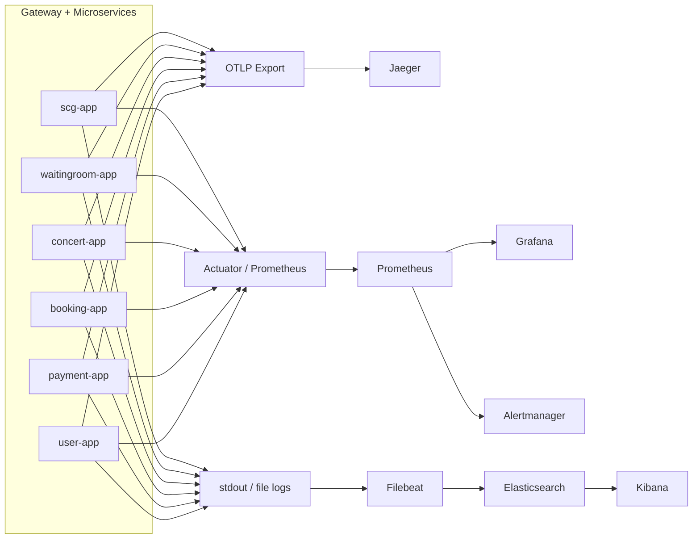

## 목차
- [1. 관측성 설계 목표](#1-관측성-설계-목표)
- [2. 관측성 스택](#2-관측성-스택)
- [3. 시그널 수집 구조](#3-시그널-수집-구조)
- [4. 로그 설계](#4-로그-설계)
- [5. 메트릭 설계](#5-메트릭-설계)
- [6. 트레이싱 전략](#6-트레이싱-전략)
- [7. 장애 감지 체계](#7-장애-감지-체계)
- [8. DB 관측성](#8-db-관측성)
- [9. Pinpoint를 왜 붙이려 하는가](#9-pinpoint를-왜-붙이려-하는가)
- [10. 운영자가 실제로 장애를 볼 때 순서](#10-운영자가-실제로-장애를-볼-때-순서)
- [Payment Confirm 심화: Background](#payment-confirm-심화-background)
- [Payment Confirm 심화: Problem](#payment-confirm-심화-problem)
- [Payment Confirm 심화: Current Design](#payment-confirm-심화-current-design)
- [Payment Confirm 심화: Operational Procedure](#payment-confirm-심화-operational-procedure)
- [Payment Confirm 심화: Failure Scenarios](#payment-confirm-심화-failure-scenarios)
- [Payment Confirm 심화: Observability / Detection](#payment-confirm-심화-observability--detection)
- [Payment Confirm 심화: Recovery / Mitigation](#payment-confirm-심화-recovery--mitigation)
- [Payment Confirm 심화: Trade-offs](#payment-confirm-심화-trade-offs)
- [Step-by-step: 사용자 결제 불만 접수 시 추적 절차](#step-by-step-사용자-결제-불만-접수-시-추적-절차)
- [Interview Explanation (90s version)](#interview-explanation-90s-version)

# Observability: 시스템 전체 관측성 설계

> 이 문서는 **시스템 전체 관측성 스택 설계**와 **payment-app 결제 confirm 흐름 심화 가이드**를 통합합니다.

---

## 1. 관측성 설계 목표

이 프로젝트에서 관측성은 단순히 "메트릭 대시보드가 있다" 수준이 아닙니다. 아래 질문에 답할 수 있어야 합니다.

1. 장애가 어디서 시작됐는가
2. 어느 서비스 구간이 가장 느린가
3. 느려진 원인이 HTTP 호출인지, SQL인지, Redis인지
4. 어떤 사용자/요청이 영향을 받았는가
5. 재시도/멱등성/보상 로직이 실제로 어떻게 움직였는가

---

## 2. 관측성 스택

**로그**: Application logs → Filebeat → Elasticsearch → Kibana

**메트릭**: Spring Boot Actuator → Prometheus → Grafana → Alertmanager

**트레이싱**: OpenTelemetry → Jaeger

**DB/APM**: P6Spy, Hibernate Statistics, slow query log, Prometheus/Grafana DB 지표, Pinpoint(차기 고도화)

---

## 3. 시그널 수집 구조



---

## 4. 로그 설계

### 4.1 공통 로그 식별자

`scg-app`은 진입 시점에 `Correlation-Id`와 `X-Request-Id`를 정리합니다. 로그에는 `traceId`, `spanId`, `correlationId`를 함께 남길 수 있게 패턴을 맞췄습니다.

실제 장애 분석 순서: 사용자 correlationId 확인 → Kibana correlationId/traceId 검색 → gateway access log에서 routeId/status/duration 확인 → Jaeger 서비스 hop 분석 → 해당 시점 DB slow query log 연결

### 4.2 gateway access log

`GatewayAccessLogGlobalFilter`에서 표준화한 필드: `routeId`, `method`, `path`, `status`, `durationMs`, `correlationId`, `userId`, `clientIp`, `signal`

**Kibana 검색 예시**:
- `status >= 500`
- `routeId = payment-service`
- `userId = 100 AND path = /api/v1/payments/confirm`
- `correlationId = <특정 요청 ID>`

---

## 5. 메트릭 설계

### 5.1 애플리케이션 공통 메트릭

`http.server.requests`, `jvm.*`, `process.*`, `tomcat.*` 또는 `reactor.netty.*`, `spring.data.repository.*`, `resilience4j.*`

### 5.2 gateway 전용 메트릭

`spring.cloud.gateway.requests`, routeId별 latency/status code 분포/5xx 비율

### 5.3 서비스별 핵심 메트릭

**waitingroom-app**: queue polling 빈도, token 발급 성공/실패, rate limit hit, Redis latency

**concert-app**: seat HOLD 충돌 횟수, AVAILABLE 좌석 조회 latency, optimistic lock 충돌 수

**booking-app**: reservation create/cancel/expire 처리량, 만료 예약 처리 배치 수, internal API 실패율

**payment-app**: prepare/confirm/cancel 요청 수, idempotency cache hit, idempotency in-progress conflict, PG approve/cancel 실호출 횟수, compensation triggered count, reservation sync failure count

**user-app**: `POST /signup` 5xx 비율, 이메일 중복 체크 실패(C001) 빈도, HikariCP active connections, `GET /users/{userId}` latency P95. user-app은 leaf service로 외부/내부 서비스 호출이 없어 병목 원인은 DB 쿼리(users 테이블 조회)와 커넥션 풀로 단순화된다.

**scg-app (보충)**: `spring.cloud.gateway.requests{routeId}` (routeId별 5xx 비율/latency), `JwtAuthenticationFilter` 실패율(401/403 응답 비율), Correlation-Id 미포함 요청 비율 (correlationId 생성 횟수로 역산). scg-app 전용 집계 메트릭은 5.2절 참조.

---

## 6. 트레이싱 전략

### 6.1 Jaeger (구현 완료 — home-staging)

6개 서비스 모두 docker-compose.yml에 OTel Agent 환경변수가 설정되어 있으며, home-staging 환경에서 Jaeger 연동이 구현 완료 상태입니다.

**OTel Agent 설정 (docker-compose.yml 기준)**:

| 서비스 | OTEL_SERVICE_NAME | OTEL_EXPORTER_OTLP_ENDPOINT |
|--------|-------------------|-----------------------------|
| scg-app | `scg` | `http://jaeger:4318` |
| waitingroom-app | `waitingroom-service` | `http://jaeger:4318` |
| concert-app | `concert-service` | `http://jaeger:4318` |
| booking-app | `booking-service` | `http://jaeger:4318` |
| payment-app | `payment-service` | `http://jaeger:4318` |
| user-app | `user-service` | `http://jaeger:4318` |

공통 설정: `OTEL_EXPORTER_OTLP_PROTOCOL: "http/protobuf"`. Jaeger UI는 `http://192.168.124.100:8080/jaeger/`에서 접근 가능합니다.

gateway에서 시작한 trace를 서비스 구간별로 확인 가능하고, payment → booking → concert 흐름처럼 multi-hop 호출을 한 눈에 볼 수 있습니다.

### 6.2 특히 봐야 하는 구간

`payment confirm`, `booking create`, `waitingroom status`, `seat hold / confirm / release`, `payment cancel` — 상태 전이, 외부 PG 연동, Redis/DB 경합이 동시에 얽힐 수 있어서 trace 가치가 큽니다.

---

## 7. 장애 감지 체계

### 7.1 기본 알림 대상

서비스 health check 실패, routeId별 5xx 비율 급증, p95/p99 latency 급증, Redis connection 문제, JDBC connection pool exhaustion, slow query 급증, Jaeger에서 payment confirm span 비정상 증가

### 7.2 대표 알림 룰 예시

아래 알림 룰은 서비스별 주요 장애 패턴을 기준으로 작성한 대표 예시다. SLO 기반 burn rate 알림 설계는 [`docs/performance/sli-slo.md`](../performance/sli-slo.md)를 참조한다.

**payment-app (결제 정합성 최우선)**:
- 최근 5분 `POST /confirm` 5xx 비율 > 3% → P1
- `POST /confirm` p95 > 1.5s → P2
- CANCEL_FAILED 로그 1건 이상 → P0 (Kibana 저장 검색으로 실시간 감지)
- `spring.cloud.gateway.requests{routeId="payment-service"}` p99 > 2s → P2

**booking-app (좌석 선점 경합)**:
- `POST /reservations` 5xx 비율 > 1% (5분 window) → P2 (4xx는 정상 경합)
- `POST /reservations` p95 > 1500ms → P2
- PENDING 만료 스케줄러 미실행 (booking-app 로그에서 주기 누락 감지) → P2

**concert-app (낙관적 락 충돌 급증 — INC-008)**:
- `POST /internal/v1/seats/{id}/hold` 409 비율 > 80% (5분 window) → 모니터링 (단독 경보 불필요)
- `POST /internal/v1/seats/{id}/hold` 5xx 비율 > 5% → P1 (409가 아닌 서버 오류)
- `GET /api/v1/seats/available/{scheduleId}` latency p95 > 300ms → P2

**waitingroom-app (대기열 가용성)**:
- `POST /api/v1/waiting-room/join` 5xx 비율 > 1% → P1 (Redis 장애 연동 가능성)
- `GET /api/v1/waiting-room/status` 5xx 비율 > 1% → P1
- Redis connection pool 포화 (`redis.clients.lettuce.command.latency.max` 급증) → P1

**user-app (계정 서비스)**:
- `POST /api/v1/users/signup` 5xx 비율 > 2% (5분 window) → P2
- HikariCP pending connections > 0, 지속 3분 이상 → P2
- C001(이메일 중복) 급증이 아닌 C999(서버 오류) 급증 시 구분 필요 → Kibana 로그 확인

**scg-app (게이트웨이)**:
- routeId별 5xx 비율 급증 (특정 서비스 장애 1차 감지) → P1
- `JwtAuthenticationFilter` 401/403 비율 급증 (토큰 발급 이슈 또는 공격 패턴) → P1
- gateway 자체 응답 지연 (upstream latency와 비교해 > 50ms overhead 지속) → P2

**인프라 공통**:
- Redis 연결 실패 (`redis-cli ping` 응답 없음) → P0
- DB CPU > 80% → P1
- `hikaricp_connections_pending{application}` > 0 지속 → P2 (서비스별 확인)

---

## 8. DB 관측성

### 8.1 P6Spy

도입 목적: 실제 실행 SQL 확인, 바인딩 값 포함 SQL 추적, traceId와 함께 SQL 로그를 묶어서 해석. `booking-app`, `payment-app`, `concert-app`, `user-app`에 권장 적용.

### 8.2 Hibernate Statistics

도입 목적: API 1회 호출당 SQL 횟수 확인, fetch 패턴/N+1 의심 확인, entity load/fetch 통계 확인

### 8.3 slow query log

`slow_query_log=ON`, staging에서는 민감하게 설정, trace/log와 묶어서 해석

### 8.4 실행계획(EXPLAIN)

체크: `type = ALL`인지, `key`가 null인지, `rows`가 과도한지, `Using temporary` / `Using filesort` 여부

---

## 9. Pinpoint를 왜 붙이려 하는가

Jaeger가 서비스 간 HTTP hop을 보는 데 강하다면, Pinpoint는 **JVM 내부 + JDBC call tree**를 자세히 보기 좋습니다. 전략: 1차 Jaeger로 서비스 경로 확인 → 2차 Pinpoint로 메서드/JDBC 병목 세부 확인. 이렇게 하면 "어느 서비스가 느린가"와 "그 서비스 안에서 어떤 쿼리가 느린가"를 분리해서 볼 수 있습니다.

---

## 10. 운영자가 실제로 장애를 볼 때 순서

1. Grafana에서 latency/오류율 이상 감지
2. Alertmanager 알림 확인
3. gateway access log에서 correlationId, routeId 확인
4. Kibana에서 해당 correlationId 로그 추적
5. Jaeger에서 span 병목 위치 확인
6. DB slow query / P6Spy / EXPLAIN으로 SQL 원인 분석
7. 필요하면 payment failureCode / reservation sync failureCode로 후속 조치

---

---

## Payment Confirm 심화: Background

> **범위**: 이 섹션은 `payment-app`의 결제 confirm 흐름에 특화된 관측성 가이드입니다. 전체 스택 개요는 위 섹션에서 다룹니다.

티켓팅 시스템에서 결제 confirm은 가장 복잡한 구간이다.
단일 요청 안에 외부 PG(TossPayments) 호출, 두 개의 internal service 호출(booking-app, concert-app),
Redis 기반 idempotency 체크, DB 상태 전이가 순차적으로 얽혀 있다.

어느 단계에서든 실패가 발생하면 사용자 돈과 예약 상태 간 정합성이 어긋날 수 있다.
이 구간을 빠르게 진단하려면 로그, 메트릭, 트레이스 세 시그널을 함께 봐야 한다.

---

## Payment Confirm 심화: Problem

결제 confirm 흐름에서 발생하는 실제 문제들:

1. **PG 응답 지연/실패**: TossPayments가 응답하지 않거나 오류를 반환하면 payment 상태가 READY에 머문다.
2. **booking confirm 실패 후 정합성 깨짐**: PG 승인은 됐지만 booking-app이 CONFIRMED로 전이하지 못하면 돈은 나갔는데 예약이 없는 상태가 된다.
3. **보상 취소 실패(CANCEL_FAILED)**: 위의 상황에서 자동 환불마저 실패하면 고객 돈이 묶인다. 수동 개입이 필요하다.
4. **멱등성 충돌**: 네트워크 재시도나 사용자 중복 클릭이 동시 처리되면 의도치 않은 이중 결제가 발생할 수 있다.

---

## Payment Confirm 심화: Current Design

### traceId vs correlationId - 중요한 구분

이 두 식별자는 서로 다른 시스템에서 생성되며 목적도 다르다.

| 식별자 | 생성 주체 | 전파 방식 | 용도 |
|---|---|---|---|
| `traceId` | Micrometer Tracing (자동) | W3C TraceContext HTTP header → MDC 자동 주입 | Jaeger span 연결, 로그-트레이스 연결 |
| `correlationId` | `scg-app` GatewayAccessLogGlobalFilter | `Correlation-Id` HTTP header | 게이트웨이 레벨 요청 추적, Kibana 로그 검색 |

`traceId`는 OpenTelemetry/Micrometer가 자동으로 MDC에 주입하기 때문에 로그 패턴 `%X{traceId:-no-trace}`로 출력된다.
`correlationId`는 SCG가 진입 시점에 UUID를 생성해 헤더로 붙이며, 각 서비스가 이 헤더를 읽어 로그에 포함해야 한다.

실제 payment-app 로그 패턴:
```
logging.pattern.console=%d{yyyy-MM-dd HH:mm:ss.SSS} [%X{traceId:-no-trace},%X{spanId:-no-span}] [%thread] %-5level %logger{36} - %msg%n
```

예시 출력:
```
2026-03-16 14:32:01.123 [abc123def456,span789] [http-nio-8084-exec-3] INFO  c.k.c.i.manager.PaymentManager - Payment created - paymentId=42, reservationId=10, orderId=RES10_1742097121123, amount=150000
```

### 결제 confirm 3가지 흐름

#### 흐름 A: 정상 결제 confirm 성공

```
클라이언트
  → [POST /api/v1/payments/confirm]
  → scg-app (Idempotency-Key 헤더 확인, correlationId 부착)
  → payment-app

payment-app 처리 순서:
1. IdempotencyManager.startProcessing(key)   → Redis SETNX payment:idempotency:{key} PROCESSING
2. PaymentReader.readByOrderId(orderId)       → DB 조회
3. PaymentValidator.validateConfirmable()     → status == READY 검증
4. PaymentValidator.validateAmount()          → 금액 일치 검증
5. TossPaymentsClient.confirmPayment()        → POST https://api.tosspayments.com/v1/payments/confirm
6. PaymentWriter.updateToApproved()           → DB status = APPROVED, paymentKey 저장
7. BookingInternalClient.confirmReservation() → POST /internal/v1/reservations/{id}/confirm
8. IdempotencyManager.complete(key, response) → Redis SET payment:idempotency:{key} {responseJson}
```

로그 시퀀스 (INFO):
```
Payment created - paymentId=42, reservationId=10, orderId=RES10_1742097121123, amount=150000
TossPayments confirm request - orderId=RES10_1742097121123, amount=150000
TossPayments confirm success - paymentKey=tviva_20260316_abc, method=카드
Payment approved - paymentId=42, orderId=RES10_1742097121123
Reservation confirmed - reservationId=10, paymentId=42
```

#### 흐름 B: booking confirm 실패 → 보상 취소 성공

```
... (흐름 A의 1~6 단계 완료, DB는 APPROVED)
7. BookingInternalClient.confirmReservation() → 실패 (booking-app 장애 or 5xx)
8. initiateRefund() 호출
9. TossPaymentsClient.cancelPayment()         → POST /v1/payments/{paymentKey}/cancel
10. PaymentWriter.updateToRefunded()           → DB status = REFUNDED
```

로그 시퀀스:
```
Payment approved - paymentId=42, orderId=RES10_1742097121123
ERROR: Reservation confirm failed - reservationId=10, initiating refund
INFO:  Payment refunded - paymentId=42, paymentKey=tviva_20260316_abc
```

최종 상태: payment.status = REFUNDED, reservation.status = PENDING (CONFIRMED 아님)

#### 흐름 C: CANCEL_FAILED 발생 (최고 심각도)

```
... (흐름 B에서 보상 취소 시도)
9. TossPaymentsClient.cancelPayment() → 실패 (PG 장애 or 네트워크 타임아웃)
10. PaymentWriter.updateToCancelFailed() → DB status = CANCEL_FAILED
```

로그 시퀀스:
```
Payment approved - paymentId=42, orderId=RES10_1742097121123
ERROR: Reservation confirm failed - reservationId=10, initiating refund
ERROR: [CRITICAL] Payment cancel failed - paymentId=42, paymentKey=tviva_20260316_abc - MANUAL INTERVENTION REQUIRED
```

최종 상태: payment.status = CANCEL_FAILED, 고객 돈 환불 안 됨. **즉시 수동 개입 필요.**

### Idempotency 설계

Redis key: `payment:idempotency:{idempotencyKey}` (String, TTL 24h)

상태 전이:
```
존재하지 않음 → SETNX → "PROCESSING" (TTL 24h)
처리 완료     → SET    → "{responseJson}" (TTL 24h)
```

Redis 장애 시 2차 방어: `ticketing_payment.payments` 테이블의 UK(`uk_reservation_id`, `uk_order_id`)가
DB 레벨에서 중복 레코드를 방지한다. 단, PG 이중 호출은 막을 수 없다.

### Jaeger OTLP 설정 (구현 완료 — home-staging)

모든 6개 서비스에 OTel Agent 환경변수가 설정되어 있으며, `http://jaeger:4318`으로 trace를 export한다. Jaeger는 `monitoring-network`에 위치하며, 서비스들은 `dev-network`와 `monitoring-network`를 동시에 연결해 Jaeger에 접근한다. Jaeger UI는 admin-gateway(Nginx)를 통해 `/jaeger/` 경로로 접근한다. oauth2-proxy 인증을 거치지 않으므로, 내부망(VPN) 접근자라면 누구든 Jaeger UI에 접근 가능하다 — 운영 시 주의 필요.

---

## Payment Confirm 심화: Operational Procedure

### Metrics

현재 payment-app에서 수집되는 메트릭은 Spring Boot Actuator 자동 메트릭이다.
아래 커스텀 결제 메트릭은 도입 예정이다 **(planned)**.

| 메트릭 이름 (planned) | 타입 | 설명 |
|---|---|---|
| `payment.confirm.total{result="success"}` | Counter | 결제 confirm 성공 횟수 |
| `payment.confirm.total{result="pg_error"}` | Counter | PG 오류로 인한 실패 횟수 |
| `payment.confirm.total{result="booking_failed"}` | Counter | booking confirm 실패로 인한 보상 트리거 횟수 |
| `payment.confirm.total{result="cancel_failed"}` | Counter | CANCEL_FAILED 발생 횟수 |
| `payment.idempotency.hit` | Counter | idempotency cache hit 횟수 |
| `payment.idempotency.conflict` | Counter | PROCESSING 상태 충돌 횟수 |
| `payment.pg.duration_seconds` | Histogram | TossPayments API 응답 시간 |

현재 사용 가능한 메트릭으로 결제 상태를 모니터링하는 방법:

**Grafana PromQL - payment-app HTTP 오류율:**
```promql
rate(http_server_requests_seconds_count{application="payment-service", status=~"5.."}[5m])
/ rate(http_server_requests_seconds_count{application="payment-service"}[5m])
```

**Grafana PromQL - confirm 엔드포인트 p95 응답 시간:**
```promql
histogram_quantile(0.95,
  rate(http_server_requests_seconds_bucket{
    application="payment-service",
    uri="/api/v1/payments/confirm"
  }[5m])
)
```

**Grafana PromQL - SCG에서 payment-service 라우트 5xx 비율:**
```promql
rate(spring_cloud_gateway_requests_seconds_count{routeId="payment-service", status=~"5.."}[5m])
```

### Logs

**Kibana에서 payment confirm 흐름을 찾는 실제 쿼리:**

1. 특정 orderId의 전체 로그 흐름 추적:
```
message:"RES10_1742097121123"
```

2. PG 실패 로그 전체 조회:
```
message:"TossPayments confirm failed"
```

3. 보상 취소 트리거 로그 조회:
```
message:"Reservation confirm failed" AND message:"initiating refund"
```

4. CRITICAL 수동 개입 필요 로그 (최고 우선순위):
```
message:"[CRITICAL] Payment cancel failed"
```

5. idempotency 충돌 조회:
```
message:"Idempotency conflict"
```

6. idempotency cache hit 조회 (재시도 패턴 분석):
```
message:"Idempotency cache hit"
```

7. 특정 traceId로 payment-app 로그 전체 조회:
```
traceId:"abc123def456"
```

8. 특정 시간 범위의 결제 실패 집계 (KQL):
```
message:"Payment failed after PG rejection" AND @timestamp >= "2026-03-16T00:00:00" AND @timestamp < "2026-03-17T00:00:00"
```

9. reservationId로 결제 생성부터 완료까지 추적:
```
message:"reservationId=10"
```

**Kibana - 로그 필드 기준 검색 (Filebeat가 JSON 파싱을 하는 경우):**
```
level:"ERROR" AND logger:"PaymentManager"
```

### Traces

**Jaeger UI(`:16686`)에서 결제 흐름 추적:**

1. Service: `payment-app` 선택 → Operation: `POST /api/v1/payments/confirm`
2. 특정 traceId 직접 검색: `Search by Trace ID` 탭에 traceId 입력
3. Tags 필터: `error=true`로 실패 span만 조회
4. Min Duration: `3s` 이상으로 설정해 느린 confirm 추출

**결제 confirm 정상 span 구조 (home-staging OTel 구현 기준):**
```
payment-app: POST /api/v1/payments/confirm          [전체 duration]
  ├── redis: GET payment:idempotency:{key}           [~1ms]
  ├── redis: SETNX payment:idempotency:{key}         [~1ms]
  ├── mysql: SELECT payments WHERE order_id=...      [~5ms]
  ├── http: POST api.tosspayments.com/v1/payments/confirm  [2~10s]
  ├── mysql: UPDATE payments SET status='APPROVED'   [~5ms]
  ├── http: POST booking-app/internal/v1/reservations/{id}/confirm [~20ms]
  └── redis: SET payment:idempotency:{key}           [~1ms]
```

span에서 비정상 패턴:
- TossPayments HTTP span이 10s 근처면 타임아웃 직전 상황
- booking-app HTTP span에 `error=true` tag가 있으면 보상 트리거 발생
- span이 `mysql: UPDATE ... CANCEL_FAILED`로 끝나면 최고 우선순위 알림 필요

---

## Payment Confirm 심화: Failure Scenarios

### 시나리오 1: TossPayments confirm 실패

**발생 조건**: PG가 4xx(카드 한도 초과, 잘못된 paymentKey 등) 또는 5xx를 반환하거나 10s read timeout 발생

**상태 전이**:
```
payment.status: READY → FAILED
reservation.status: PENDING (변화 없음)
좌석: HOLD (5분 TTL 내 자동 해제)
```

**로그**:
```
ERROR: TossPayments confirm failed - orderId=RES10_xxx, httpStatus=400, body={"code":"INVALID_CARD_COMPANY",...}
ERROR: Payment failed after PG rejection - orderId=RES10_xxx
```

**확인 쿼리**:
```sql
SELECT payment_id, order_id, status, fail_reason, created_at, updated_at
FROM ticketing_payment.payments
WHERE order_id = 'RES10_xxx';
```

### 시나리오 2: booking confirm 실패 → 보상 취소 성공

**발생 조건**: PG 승인 완료 후 booking-app 호출 실패 (booking-app 장애, 네트워크 단절, 예약 상태 불일치)

**상태 전이**:
```
payment.status: READY → APPROVED → REFUNDED
reservation.status: PENDING (변화 없음)
```

**로그**:
```
INFO:  Payment approved - paymentId=42, orderId=RES10_xxx
ERROR: Reservation confirm failed - reservationId=10, initiating refund
INFO:  Payment refunded - paymentId=42, paymentKey=tviva_xxx
```

### 시나리오 3: CANCEL_FAILED (최고 심각도)

**발생 조건**: booking confirm 실패 후 PG 취소 API마저 실패

**상태 전이**:
```
payment.status: READY → APPROVED → CANCEL_FAILED
reservation.status: PENDING
고객 돈: PG에서 승인 완료된 상태 (환불 안 됨)
```

**로그**:
```
INFO:  Payment approved - paymentId=42, orderId=RES10_xxx
ERROR: Reservation confirm failed - reservationId=10, initiating refund
ERROR: [CRITICAL] Payment cancel failed - paymentId=42, paymentKey=tviva_xxx - MANUAL INTERVENTION REQUIRED
```

---

## Payment Confirm 심화: Observability / Detection

### 1. Kibana - CANCEL_FAILED 즉시 감지

Kibana에서 아래 쿼리를 저장된 검색(Saved Search)으로 등록하고 알림을 설정해야 한다:
```
message:"[CRITICAL] Payment cancel failed"
```
이 로그가 단 1건이라도 발생하면 즉각 수동 개입이 필요하다.

### 2. Grafana - payment 5xx 급증 패널

패널 이름: `payment-app 5xx rate`
```promql
sum(rate(http_server_requests_seconds_count{
  application="payment-service",
  status=~"5.."
}[5m]))
```
임계값: 1분 내 5회 이상이면 알람.

### 3. DB - CANCEL_FAILED 잔류 레코드 직접 조회

```sql
SELECT
    payment_id,
    reservation_id,
    user_id,
    order_id,
    payment_key,
    amount,
    status,
    fail_reason,
    created_at,
    updated_at
FROM ticketing_payment.payments
WHERE status = 'CANCEL_FAILED'
ORDER BY updated_at DESC;
```

### 4. DB - READY 상태로 30분 이상 잔류하는 결제 (PG timeout 의심)

```sql
SELECT
    payment_id,
    reservation_id,
    order_id,
    amount,
    status,
    created_at,
    TIMESTAMPDIFF(MINUTE, created_at, NOW()) AS minutes_elapsed
FROM ticketing_payment.payments
WHERE status = 'READY'
  AND created_at < DATE_SUB(NOW(), INTERVAL 30 MINUTE)
ORDER BY created_at ASC;
```

### 5. DB - 특정 reservationId의 결제 상태 확인

```sql
SELECT payment_id, reservation_id, order_id, payment_key, amount, status, fail_reason, approved_at, cancelled_at, created_at, updated_at
FROM ticketing_payment.payments
WHERE reservation_id = 10;
```

### 6. Redis - idempotency 상태 직접 확인

특정 키의 현재 상태 확인:
```bash
redis-cli -h 192.168.124.101 -p 6379 GET "payment:idempotency:{idempotencyKey}"
```

PROCESSING 상태로 멈춰있는 경우 (처리 중 crash 발생):
```bash
# 현재 값이 "PROCESSING"인지 확인
redis-cli -h 192.168.124.101 -p 6379 GET "payment:idempotency:my-idempotency-key-123"

# TTL 확인 (음수면 만료됨)
redis-cli -h 192.168.124.101 -p 6379 TTL "payment:idempotency:my-idempotency-key-123"
```

모든 payment idempotency 키 목록 조회 (운영 주의 - SCAN 사용):
```bash
redis-cli -h 192.168.124.101 -p 6379 --scan --pattern "payment:idempotency:*"
```

idempotency 키 수동 삭제 (재시도 허용할 때):
```bash
redis-cli -h 192.168.124.101 -p 6379 DEL "payment:idempotency:my-idempotency-key-123"
```

### 7. Jaeger - 결제 confirm 비정상 span 탐색

Jaeger UI(`:16686`)에서:
- Service: `payment-app`
- Operation: `POST /api/v1/payments/confirm`
- Tags: `error=true`
- 기간 필터: 최근 1시간

---

## Payment Confirm 심화: Recovery / Mitigation

### CANCEL_FAILED 수동 복구 절차

1. DB에서 CANCEL_FAILED 레코드의 `payment_key` 조회:
```sql
SELECT payment_id, payment_key, amount, reservation_id
FROM ticketing_payment.payments
WHERE status = 'CANCEL_FAILED';
```

2. TossPayments 관리자 콘솔에서 `payment_key`로 현재 취소 상태 확인

3. TossPayments가 취소 처리가 안 된 경우, 수동 API 호출:
```bash
curl -X POST https://api.tosspayments.com/v1/payments/{paymentKey}/cancel \
  -u {secretKey}: \
  -H "Content-Type: application/json" \
  -d '{"cancelReason": "운영자 수동 환불 처리"}'
```

4. TossPayments 취소 성공 확인 후 DB 수동 업데이트:
```sql
UPDATE ticketing_payment.payments
SET status = 'REFUNDED',
    cancelled_at = NOW(),
    updated_at = NOW()
WHERE payment_id = {paymentId}
  AND status = 'CANCEL_FAILED';
```

5. 고객에게 환불 완료 안내

### PROCESSING 상태 멈춘 idempotency 키 정리

처리 중 애플리케이션이 crash하면 Redis에 "PROCESSING" 값이 남을 수 있다.
TTL 24h가 지나면 자동 해제되지만, 즉시 재시도를 허용해야 한다면:
```bash
redis-cli -h 192.168.124.101 -p 6379 DEL "payment:idempotency:{key}"
```
단, DB를 먼저 확인해서 실제로 결제가 처리됐는지 검증한 후 삭제해야 한다.

---

## Payment Confirm 심화: Trade-offs

### 1. 트랜잭션 경계 분리

**PaymentManager.confirmPayment()는 `@Transactional`이 없다.**
대신 `PaymentWriter`의 각 update 메서드가 독립 트랜잭션이다.

이유: TossPayments API 호출(최대 10s) 동안 DB 커넥션을 점유하면, connection pool(max 20) 소진 위험이 있다.

트레이드오프: APPROVED 업데이트와 booking confirm 호출 사이에 crash가 나면 DB는 APPROVED이나 booking은 PENDING이다.
이 불일치를 CANCEL_FAILED 경로 없이 복구하려면 별도의 reconciliation job이 필요하다 (현재 미구현).

### 2. Redis idempotency vs DB UK

Redis가 1차 방어이고 DB UK가 2차 방어다.
Redis 장애 시 DB UK가 `reservation_id` 중복을 막지만, PG 이중 호출은 여전히 가능하다.
PG 이중 호출 방지는 TossPayments의 orderId UK 정책에 의존한다.

### 3. OTLP Jaeger 설정 (구현 완료 — home-staging)

모든 6개 서비스에 OTel Agent 환경변수가 설정 완료됐다. 서비스명은 `OTEL_SERVICE_NAME` 기준이며 Prometheus `application` 태그와 동일한 값을 사용한다 (예: `payment-service`, `booking-service`). Jaeger에서 trace가 보이지 않으면 서비스가 `monitoring-network`에 연결됐는지, Jaeger 컨테이너가 기동 중인지 먼저 확인한다.

### 4. 커스텀 메트릭 미구현 (planned)

현재 결제 성공/실패/보상 횟수를 Prometheus 커스텀 메트릭으로 수집하지 않는다.
Grafana에서 결제 비즈니스 지표를 보려면 Kibana 로그 집계 또는 커스텀 메트릭 추가가 필요하다.

---

## Step-by-step: 사용자 결제 불만 접수 시 추적 절차

> 시나리오: "결제했는데 예약이 안 됐어요" 또는 "돈이 나갔는데 환불이 안 됩니다"

**1단계: 사용자로부터 수집할 정보**
- 결제 시도 시각 (분 단위)
- userId 또는 이메일
- reservationId (예약 번호)
- 결제 금액

**2단계: DB에서 결제 상태 확인**
```sql
SELECT
    p.payment_id,
    p.reservation_id,
    p.user_id,
    p.order_id,
    p.payment_key,
    p.amount,
    p.status,
    p.method,
    p.fail_reason,
    p.approved_at,
    p.cancelled_at,
    p.created_at,
    p.updated_at
FROM ticketing_payment.payments p
WHERE p.reservation_id = {reservationId}
   OR p.user_id = {userId}
ORDER BY p.created_at DESC
LIMIT 5;
```

**3단계: status에 따른 분기**

- `READY`: PG 호출이 실패하거나 아직 진행 중. orderId로 TossPayments API 조회
- `APPROVED`: PG 승인됐으나 booking이 CONFIRMED 아님. booking-app 상태 확인 필요
- `REFUNDED`: 정상 환불 완료. 고객에게 환불 완료 안내
- `CANCEL_FAILED`: 즉시 수동 복구 절차 진행
- `FAILED`: PG 거절. fail_reason 확인 후 고객 안내

**4단계: Kibana에서 로그 추적**

orderId 또는 reservationId로 검색:
```
message:"reservationId=10" OR message:"RES10_"
```

시간 범위를 신고 시각 ±30분으로 좁힌 후 INFO/ERROR 로그 확인.

**5단계: traceId 확보 후 Jaeger 조회**

Kibana 로그에서 `traceId` 필드 값을 복사 → Jaeger UI `:16686` → `Search by Trace ID` 탭에 입력.
span 목록에서 `error=true`인 구간의 태그와 로그를 확인.

**6단계: Redis idempotency 상태 확인 (재시도 관련 불만 시)**

사용자가 중복 결제를 주장하거나 "요청이 안 됐다"고 하면:
```bash
redis-cli -h 192.168.124.101 -p 6379 GET "payment:idempotency:{idempotencyKey}"
```
`PROCESSING` → 처리 중 crash 가능성. DB 확인 후 판단.
`{JSON}` → 이미 처리된 요청. 응답 내용 확인.
`(nil)` → 24h 이내에 요청한 적 없거나 TTL 만료.

---

## Interview Explanation (90s version)

"결제 confirm 흐름은 TossPayments 외부 API 호출, booking-app 내부 API 호출, Redis idempotency 체크, DB 상태 전이가
하나의 요청 안에 순차적으로 얽혀 있습니다. 이 구간을 관측하기 위해 세 가지 시그널을 연결했습니다.

첫째, 로그에는 Micrometer Tracing이 자동으로 주입하는 traceId와, SCG가 생성해 헤더로 전파하는 correlationId를
함께 출력합니다. 이 둘은 서로 다른 시스템에서 만들어지며 목적도 다릅니다. traceId는 Jaeger 구간 연결에,
correlationId는 Kibana 게이트웨이 로그 검색에 씁니다.

둘째, PaymentManager의 로그는 결제 생성부터 PG 호출, DB 업데이트, booking confirm까지 각 단계를 명시적으로 기록합니다.
CANCEL_FAILED처럼 고객 돈이 묶이는 상황은 [CRITICAL] 프리픽스로 표시해 Kibana 알림으로 즉시 탐지합니다.

셋째, DB의 idx_status 인덱스를 통해 CANCEL_FAILED나 장기 READY 상태를 SQL로 직접 조회합니다.

Jaeger OTLP 연동은 home-staging에서 구현 완료 상태입니다. payment confirm span에서 PG 응답 시간과 booking-app 호출 실패 위치를 한 눈에 볼 수 있습니다."
